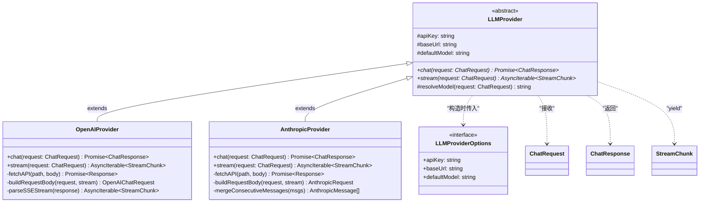
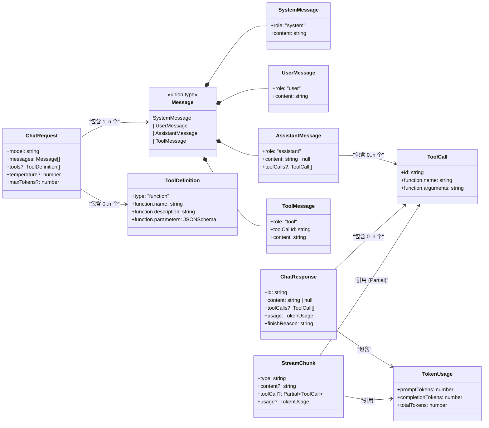
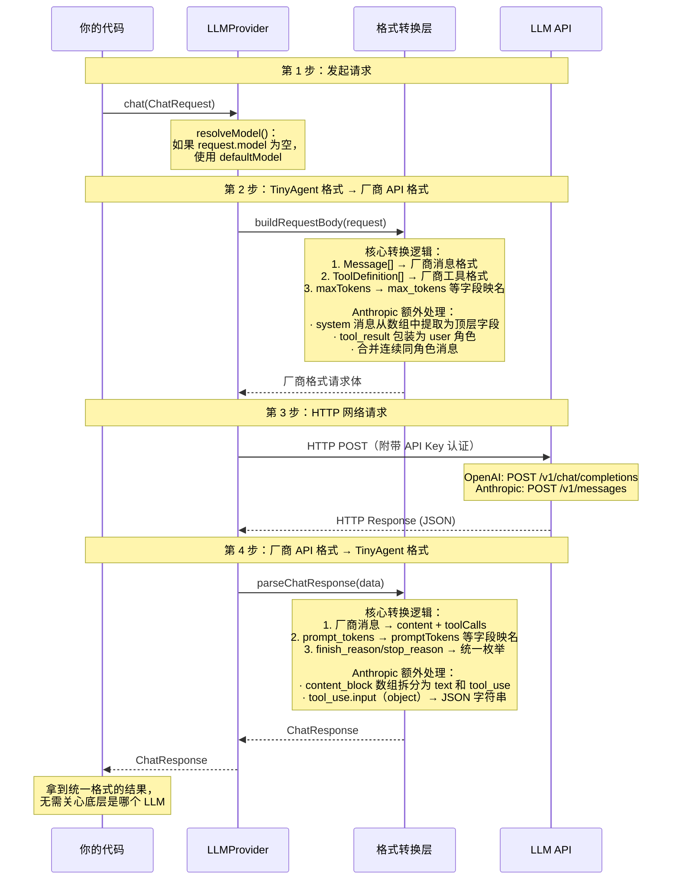

# Chapter 01: 与 LLM 对话 -- Provider 抽象层

## 本章目标

学完本章，你将能够：

1. 理解 LLM API 的核心概念（Token、Temperature、上下文窗口、Function Calling）
2. 设计一个可插拔的 Provider 抽象层，支持 OpenAI / Anthropic / DeepSeek 等多种模型
3. 手写 HTTP 调用 LLM API，不依赖任何官方 SDK
4. 处理流式（Streaming）和非流式两种响应模式
5. 理解 OpenAI 和 Anthropic 两种 API 格式的差异

## 核心概念

在写任何代码之前，你需要理解以下概念。这些是 Agent 开发的基石。

### 什么是 LLM API

LLM（Large Language Model，大语言模型）本身是一个运行在远程服务器上的模型。我们通过 HTTP API 与它交互：发送一段文本（Prompt），它返回一段生成的文本（Completion）。

这个过程本质上就是一个普通的 HTTP POST 请求，没有任何黑魔法。

### Token

Token 是 LLM 处理文本的基本单位。一个 Token 大约等于：
- 英文：约 4 个字符，或 3/4 个单词
- 中文：约 1-2 个汉字

Token 非常重要，因为：
- **计费**：LLM API 按 Token 数计费（输入 Token + 输出 Token）
- **上下文窗口**：每个模型有 Token 上限（如 GPT-4o 为 128K tokens），超过就丢失信息
- **性能**：Token 数越多，响应越慢

> 📖 权威参考: [OpenAI Tokenizer](https://platform.openai.com/tokenizer) -- 可在线试验文本的 Token 化结果

### Temperature

Temperature（温度）控制生成结果的随机性：
- `0`：完全确定性，每次生成相同结果（适合 Agent 的工具调用）
- `0.7`：适度随机（适合日常对话）
- `1.0+`：高随机性（适合创意写作）

在 Agent 场景中，我们通常使用较低的 Temperature（0-0.3），因为工具调用需要精确的 JSON 输出。

### 上下文窗口

上下文窗口（Context Window）是模型一次能"看到"的最大 Token 数，包含输入和输出。

| 模型 | 上下文窗口 |
|------|------------|
| GPT-4o | 128K tokens |
| GPT-4o-mini | 128K tokens |
| Claude Sonnet 4 | 200K tokens |
| DeepSeek-V3 | 128K tokens |

当对话超过上下文窗口时，最早的消息会被截断。这就是为什么我们后面需要设计 Memory 系统（Chapter 04）。

### 消息角色

LLM API 使用"消息"来组织对话，每条消息都有一个角色（Role）：

| 角色 | 说明 | 示例 |
|------|------|------|
| `system` | 系统指令，定义 Agent 的行为和身份 | "你是一个代码审查专家" |
| `user` | 用户输入 | "帮我检查这段代码" |
| `assistant` | LLM 的回复 | "这段代码有以下问题..." |
| `tool` | 工具调用的返回结果 | `{"result": 42}` |

> 📖 权威参考:
> - [OpenAI Chat Completions API](https://platform.openai.com/docs/api-reference/chat)
> - [Anthropic Messages API](https://docs.anthropic.com/en/api/messages)

## 架构设计

我们要设计的 Provider 层遵循**策略模式（Strategy Pattern）**：定义统一接口，不同 Provider 各自实现。

### 图 1: Provider 层级关系图

> **这张图回答的问题**：框架里有哪些类？它们之间是什么继承/依赖关系？
>
> **怎么读这张图**：
> - 最上面的 `LLMProvider` 是抽象基类，定义了所有 Provider 必须实现的方法
> - `OpenAIProvider` 和 `AnthropicProvider` 是两个具体实现，通过继承（实线三角箭头）获得基类的属性
> - 虚线箭头表示"使用"关系 -- Provider 接收 `ChatRequest`、返回 `ChatResponse`、流式时 yield `StreamChunk`
> - `+` 表示 public 方法，`#` 表示 protected 属性，`-` 表示 private 方法
> - 带 `*` 的方法是抽象方法（子类必须实现）



**要点解读**：

| 设计决策 | 为什么这样做 |
|----------|-------------|
| `LLMProvider` 是抽象类而非接口 | 因为它既定义契约（`abstract chat/stream`），又包含公共逻辑（`resolveModel`），用抽象类可以两者兼顾 |
| 两个 Provider 各自有 private 方法 | `buildRequestBody` 和 `parseSSEStream` 封装了各厂商的格式差异，这些细节不应暴露给外部 |
| `AnthropicProvider` 多了 `mergeConsecutiveMessages` | 这是 Anthropic 独有的约束 -- 它要求消息必须 user/assistant 交替出现，所以需要额外的合并逻辑 |
| `OpenAIProvider` 可以服务 DeepSeek/Ollama | 只需要传入不同的 `baseUrl` 和 `apiKey`，因为这些服务都兼容 OpenAI 的 API 格式 |

---

### 图 2: 类型依赖关系图

> **这张图回答的问题**：`src/types.ts` 中定义的十几个类型，哪些引用了哪些？数据结构之间怎么嵌套？
>
> **怎么读这张图**：
> - **实心菱形线**（`*--`）= 组合关系，表示"`Message` 由这 4 种具体消息组成"
> - **箭头线**（`-->`）= 引用关系，表示"A 的某个字段的类型是 B"
> - 箭头上的文字说明了引用方式（如 "包含 0..n 个" 表示是可选数组）
> - 左半部分是**消息体系**（对话的内容），右半部分是**请求/响应体系**（与 API 的交互）



**要点解读**：

这张图可以分为 **3 个区域**来理解：

**区域 A -- 消息体系（左侧）**：`Message` 是一个联合类型（Union Type），由 4 种具体消息组成。其中 `AssistantMessage` 最特殊——它的 `content` 可以为 `null`（当 LLM 选择调用工具而不输出文字时），并且可以携带 `ToolCall[]`。`ToolMessage` 通过 `toolCallId` 与某个 `ToolCall` 形成对应关系（"我是哪个工具调用的返回结果"）。

**区域 B -- 工具体系（中间）**：`ToolCall` 是 LLM 发出的"我要调用某个工具"的指令，`ToolDefinition` 是你告诉 LLM "有哪些工具可用"的描述。注意两者不是同一个东西——`ToolDefinition` 是菜单，`ToolCall` 是点单。

**区域 C -- 请求/响应体系（右侧）**：`ChatRequest` 打包了消息和工具定义发给 LLM；`ChatResponse` 是同步返回的完整结果；`StreamChunk` 是流式返回的一小块数据。`StreamChunk` 中的 `toolCall` 用了 `Partial<ToolCall>`，因为流式传输时工具调用的 JSON 参数是逐字到达的，中间状态是不完整的。

---

### 图 3: 数据流向图

> **这张图回答的问题**：当你调用 `provider.chat(request)` 时，数据经过了哪些步骤，最终是怎么变成 `ChatResponse` 返回给你的？
>
> **怎么读这张图**：
> - 从上往下是时间顺序
> - 实线箭头 = 主动调用，虚线箭头 = 返回
> - 黄色便签是该步骤的关键说明
> - "格式转换层"并不是一个独立的类，而是 Provider 内部的 private 方法群（如 `toOpenAIMessage`、`parseChatResponse`），这里拎出来是为了强调 Provider 的核心职责



**要点解读**：

这张图揭示了 Provider 层最核心的设计思想——**双向格式适配**：

```
你的代码 (TinyAgent 格式)
    ↓  buildRequestBody()   -- 正向转换
厂商 API (OpenAI/Anthropic 格式)
    ↓  HTTP 请求
LLM 服务器
    ↓  HTTP 响应
厂商 API (OpenAI/Anthropic 格式)
    ↓  parseChatResponse()  -- 逆向转换
你的代码 (TinyAgent 格式)
```

这就是为什么你的 Agent 代码只需要依赖 `LLMProvider` 抽象接口——所有厂商差异都被 Provider 内部的转换方法消化了。当你要新增一个 Provider（比如接入 Google Gemini），只需要实现这两个方向的转换逻辑，Agent 代码一行都不用改。

### 层次总览

```
┌─────────────────────────────────────────┐
│              你的 Agent 代码              │
│         (只依赖 LLMProvider 接口)         │
└──────────────────┬──────────────────────┘
                   │ chat() / stream()
                   ▼
┌─────────────────────────────────────────┐
│           LLMProvider (抽象基类)          │
│  - apiKey, baseUrl, defaultModel        │
│  - abstract chat(request): Response     │
│  - abstract stream(request): AsyncIter  │
└──────┬──────────┬──────────┬────────────┘
       │          │          │
       ▼          ▼          ▼
┌──────────┐ ┌──────────┐ ┌──────────────┐
│ OpenAI   │ │Anthropic │ │ OpenAI       │
│ Provider │ │ Provider │ │ (DeepSeek)   │
└──────────┘ └──────────┘ └──────────────┘
```

### 为什么不直接用官方 SDK

本教程故意不使用 OpenAI 或 Anthropic 的官方 SDK，原因是：

1. **理解底层**：你需要知道 API 实际上在发什么、收什么，这对调试至关重要
2. **格式适配**：不同厂商的 API 格式差异很大，Provider 层的核心职责就是统一这些差异
3. **零依赖**：减少外部依赖，框架更轻量、更可控
4. **可扩展**：你可以轻松适配任何兼容 OpenAI 格式的本地模型（如 Ollama）

## 逐步实现

### 第一步：定义统一类型

所有 Provider 共享一套消息和请求/响应类型。这是 Provider 层的"契约"。

**文件: `src/types.ts`**

```typescript
// 消息类型 -- LLM 对话的基本单元
export type MessageRole = 'system' | 'user' | 'assistant' | 'tool';

export interface SystemMessage {
  role: 'system';
  content: string;
}

export interface UserMessage {
  role: 'user';
  content: string;
}

export interface AssistantMessage {
  role: 'assistant';
  content: string | null;   // 当 LLM 选择调用工具时，content 可能为 null
  toolCalls?: ToolCall[];    // LLM 决定调用的工具列表
}

export interface ToolMessage {
  role: 'tool';
  toolCallId: string;        // 对应哪个 toolCall 的结果
  content: string;           // 工具执行结果（序列化为字符串）
}

export type Message = SystemMessage | UserMessage | AssistantMessage | ToolMessage;
```

注意 `AssistantMessage` 的设计：
- `content` 是 `string | null`，因为当 LLM 决定调用工具时，它可能不返回文本内容
- `toolCalls` 是可选的，只有当 LLM 决定使用工具时才存在

```typescript
// 工具调用类型
export interface ToolCall {
  id: string;                 // 工具调用的唯一标识（由 LLM 生成）
  function: {
    name: string;             // 要调用的工具名
    arguments: string;        // 工具参数（JSON 字符串）
  };
}

// 工具定义（告诉 LLM 有哪些工具可用）
export interface ToolDefinition {
  type: 'function';
  function: {
    name: string;
    description: string;      // 工具描述 -- 这是 Prompt Engineering 的一部分！
    parameters: Record<string, unknown>;  // JSON Schema 格式的参数定义
  };
}
```

```typescript
// 请求和响应
export interface ChatRequest {
  model: string;
  messages: Message[];
  tools?: ToolDefinition[];
  temperature?: number;
  maxTokens?: number;
  stop?: string[];
}

export interface ChatResponse {
  id: string;
  content: string | null;
  toolCalls?: ToolCall[];
  usage: TokenUsage;
  finishReason: 'stop' | 'tool_calls' | 'length' | 'error';
}

export interface TokenUsage {
  promptTokens: number;
  completionTokens: number;
  totalTokens: number;
}

// 流式输出的数据块
export interface StreamChunk {
  type: 'text_delta' | 'tool_call_delta' | 'usage' | 'done';
  content?: string;
  toolCall?: Partial<ToolCall>;
  usage?: TokenUsage;
}
```

### 第二步：抽象基类

**文件: `src/providers/base.ts`**

```typescript
import type { ChatRequest, ChatResponse, StreamChunk } from '../types.js';

export interface LLMProviderOptions {
  apiKey: string;
  baseUrl: string;
  defaultModel: string;
}

export abstract class LLMProvider {
  protected apiKey: string;
  protected baseUrl: string;
  protected defaultModel: string;

  constructor(options: LLMProviderOptions) {
    this.apiKey = options.apiKey;
    this.baseUrl = options.baseUrl;
    this.defaultModel = options.defaultModel;
  }

  // 子类必须实现这两个方法
  abstract chat(request: ChatRequest): Promise<ChatResponse>;
  abstract stream(request: ChatRequest): AsyncIterable<StreamChunk>;

  protected resolveModel(request: ChatRequest): string {
    return request.model || this.defaultModel;
  }
}
```

这个基类只做三件事：
1. 保存连接配置（apiKey、baseUrl、defaultModel）
2. 定义接口契约（`chat` 和 `stream` 两个抽象方法）
3. 提供一个公共的 model 解析方法

### 第三步：实现 OpenAI Provider

这是核心实现。分为三个部分讲解。

**文件: `src/providers/openai.ts`**

#### 3.1 构造函数 -- 自动读取环境变量

```typescript
export class OpenAIProvider extends LLMProvider {
  constructor(options?: Partial<LLMProviderOptions>) {
    super({
      apiKey: options?.apiKey ?? process.env.OPENAI_API_KEY ?? '',
      baseUrl: options?.baseUrl ?? process.env.OPENAI_BASE_URL ?? 'https://api.openai.com/v1',
      defaultModel: options?.defaultModel ?? 'gpt-4o',
    });
  }
```

设计要点：
- 支持手动传入配置，也支持自动从环境变量读取
- `baseUrl` 可配置，这意味着同一个 Provider 可以对接 DeepSeek、Ollama 等兼容 OpenAI 格式的服务

#### 3.2 非流式请求 -- chat()

```typescript
async chat(request: ChatRequest): Promise<ChatResponse> {
  const body = this.buildRequestBody(request, false);
  const response = await this.fetchAPI('/chat/completions', body);

  if (!response.ok) {
    const error = await response.text();
    throw new Error(`OpenAI API error (${response.status}): ${error}`);
  }

  const data = await response.json();
  return this.parseChatResponse(data);
}
```

流程很简单：
1. 将 TinyAgent 格式转换为 OpenAI API 格式（`buildRequestBody`）
2. 发送 HTTP POST 请求（`fetchAPI`）
3. 将 OpenAI 响应格式转换回 TinyAgent 格式（`parseChatResponse`）

这个"转换 → 请求 → 转换"的模式就是 Provider 层的核心逻辑。

#### 3.3 流式请求 -- stream()

流式响应使用 SSE（Server-Sent Events）协议，这是一种基于 HTTP 的服务端推送协议：

```
data: {"id":"chatcmpl-xxx","choices":[{"delta":{"content":"你"}}]}

data: {"id":"chatcmpl-xxx","choices":[{"delta":{"content":"好"}}]}

data: {"id":"chatcmpl-xxx","choices":[{"delta":{"content":"！"}}]}

data: [DONE]
```

每一行以 `data: ` 开头，包含一个 JSON 对象。最后一行是 `data: [DONE]` 表示结束。

我们的 `stream()` 方法是一个 **异步生成器（Async Generator）**，它逐块读取响应并 yield 出标准化的 `StreamChunk`：

```typescript
async *stream(request: ChatRequest): AsyncIterable<StreamChunk> {
  const body = this.buildRequestBody(request, true);  // stream: true
  const response = await this.fetchAPI('/chat/completions', body);

  if (!response.ok) {
    const error = await response.text();
    throw new Error(`OpenAI API error (${response.status}): ${error}`);
  }

  yield* this.parseSSEStream(response);
}
```

SSE 解析的关键代码：

```typescript
private async *parseSSEStream(response: Response): AsyncIterable<StreamChunk> {
  const reader = response.body?.getReader();
  if (!reader) throw new Error('Response body is not readable');

  const decoder = new TextDecoder();
  let buffer = '';

  try {
    while (true) {
      const { done, value } = await reader.read();
      if (done) break;

      // 将二进制数据解码为文本，拼接到缓冲区
      buffer += decoder.decode(value, { stream: true });

      // 按行分割，处理每一行
      const lines = buffer.split('\n');
      buffer = lines.pop() ?? '';  // 最后一行可能不完整，留在缓冲区

      for (const line of lines) {
        const trimmed = line.trim();
        if (!trimmed || !trimmed.startsWith('data: ')) continue;

        const data = trimmed.slice(6);  // 去掉 "data: " 前缀
        if (data === '[DONE]') {
          yield { type: 'done' };
          return;
        }

        const chunk = JSON.parse(data);
        // ... 处理 chunk，yield 出 StreamChunk
      }
    }
  } finally {
    reader.releaseLock();
  }
}
```

这段代码有几个重要的细节：
1. **缓冲区机制**：网络传输的数据块不一定在行边界处断开，需要缓冲区来处理
2. **`decoder.decode(value, { stream: true })`**：`stream: true` 防止多字节字符被截断
3. **`lines.pop()`**：最后一行可能是不完整的，保留到下一次读取

### 第四步：实现 Anthropic Provider

Anthropic 的 API 与 OpenAI 有几个关键差异，理解这些差异是 Provider 层存在的意义：

| 差异点 | OpenAI | Anthropic |
|--------|--------|-----------|
| System 消息 | 在 messages 数组中 | 独立的 `system` 字段 |
| 工具调用 | `tool_calls` 是消息属性 | `tool_use` 是 content block |
| 工具结果 | `tool` 角色的消息 | `user` 消息中的 `tool_result` block |
| 消息顺序 | 无严格限制 | 必须 user/assistant 交替 |
| 认证方式 | `Authorization: Bearer` | `x-api-key` header |
| 流式事件 | 统一的 `data:` 行 | 细分的事件类型 |

**文件: `src/providers/anthropic.ts`**

核心差异 1 -- System 消息的处理：

```typescript
private buildRequestBody(request: ChatRequest, stream: boolean): AnthropicRequest {
  let systemPrompt: string | undefined;
  const messages: AnthropicMessage[] = [];

  for (const msg of request.messages) {
    if (msg.role === 'system') {
      systemPrompt = msg.content;  // 提取出来，放到独立字段
      continue;
    }
    // ... 转换其他消息
  }

  return {
    model: this.resolveModel(request),
    messages,
    system: systemPrompt,  // Anthropic 的 system 是顶层字段
    max_tokens: request.maxTokens ?? 4096,
    stream,
  };
}
```

核心差异 2 -- 工具调用使用 Content Block：

```typescript
// OpenAI 的 assistant 消息:
{ role: 'assistant', content: null, tool_calls: [{ id: '...', function: {...} }] }

// Anthropic 的 assistant 消息:
{
  role: 'assistant',
  content: [
    { type: 'text', text: '让我查一下...' },
    { type: 'tool_use', id: '...', name: 'search', input: {...} }
  ]
}
```

核心差异 3 -- 工具结果放在 user 消息中：

```typescript
// OpenAI:
{ role: 'tool', tool_call_id: '...', content: '结果' }

// Anthropic:
{
  role: 'user',
  content: [
    { type: 'tool_result', tool_use_id: '...', content: '结果' }
  ]
}
```

这个差异会导致 Anthropic 的 tool_result 和用户的新消息都是 `user` 角色，产生连续的同角色消息。我们需要用 `mergeConsecutiveMessages()` 方法合并它们。

完整的 Anthropic Provider 实现请参考 `src/providers/anthropic.ts`。

### 第五步：使用 Provider

**基础用法：**

```typescript
import { OpenAIProvider } from './providers/openai.js';

const provider = new OpenAIProvider();

const response = await provider.chat({
  model: 'gpt-4o-mini',
  messages: [
    { role: 'system', content: '你是一个助手。' },
    { role: 'user', content: '你好！' },
  ],
});

console.log(response.content);
```

**切换到 DeepSeek（兼容 OpenAI 格式）：**

```typescript
const deepseek = new OpenAIProvider({
  apiKey: process.env.DEEPSEEK_API_KEY,
  baseUrl: 'https://api.deepseek.com/v1',
  defaultModel: 'deepseek-chat',
});
```

**流式输出：**

```typescript
for await (const chunk of provider.stream({ model: 'gpt-4o-mini', messages })) {
  if (chunk.type === 'text_delta') {
    process.stdout.write(chunk.content ?? '');
  }
}
```

**依赖抽象，不依赖具体实现（关键设计原则）：**

```typescript
async function askQuestion(provider: LLMProvider, question: string) {
  // 这个函数不关心底层是 OpenAI 还是 Anthropic
  return provider.chat({
    model: '',
    messages: [{ role: 'user', content: question }],
  });
}
```

## 测试验证

本章采用 **两层测试策略**：

1. **单元测试（不需要 API Key）**：用 `vi.spyOn(globalThis, 'fetch')` mock 掉 HTTP 请求，测试所有格式转换和解析逻辑
2. **集成测试（需要 API Key）**：用真实 API 验证端到端是否通畅

### 运行单元测试

```bash
# 运行所有测试（不需要 API Key）
pnpm test

# 运行并监听文件变化（开发时推荐）
pnpm test:watch
```

期望输出：

```
 ✓ src/providers/__tests__/anthropic.test.ts (17 tests)
 ✓ src/providers/__tests__/openai.test.ts (17 tests)

 Test Files  2 passed (2)
      Tests  34 passed (34)
```

### 单元测试覆盖的场景

我们的测试按功能维度组织，覆盖了所有关键路径：

**OpenAI Provider -- 17 个测试**

| 测试组 | 测试内容 | 验证什么 |
|--------|----------|----------|
| 文本对话 | 解析文本回复、Token 用量、默认 model | `parseChatResponse` 正确映射字段 |
| 工具调用 | 解析 `tool_calls` 数组 | content block 格式差异处理 |
| 请求格式转换 | 4 种消息角色、工具定义、temperature/maxTokens/stop、header、URL | `buildRequestBody` 正确转换 |
| 错误处理 | 非 200 状态码、空 choices | 异常路径不会静默失败 |
| 流式文本 | 逐块 yield、done 事件、stream=true 参数 | SSE 解析器工作正常 |
| 流式工具调用 | 分片参数累积 | `toolCallAccumulator` 正确拼接 |
| SSE 分包 | 数据在任意字节处断开 | 缓冲区机制正确处理 TCP 分包 |
| 流式错误 | 非 200 状态码 | 流式场景的异常处理 |

**Anthropic Provider -- 17 个测试**

| 测试组 | 测试内容 | 验证什么 |
|--------|----------|----------|
| 文本对话 | 文本解析、Token 映射 (`input_tokens` → `promptTokens`) | Anthropic 特有的字段名映射 |
| 工具调用 | content block 中提取 `tool_use`、`input` 序列化 | Anthropic 独有的 content block 格式 |
| 请求格式 | system 提取为顶层字段、tool→user 转换、连续消息合并、tool_use block、工具定义 (`input_schema`)、x-api-key header、URL、默认 max_tokens | 所有 Anthropic vs OpenAI 的差异点 |
| 错误处理 | 非 200 状态码 | Anthropic 特有的错误码（如 529） |
| 流式文本 | text_delta、usage、done | Anthropic 分事件类型的流式格式 |
| 流式工具调用 | `input_json_delta` 累积 | Anthropic 独有的 JSON 增量格式 |

### 测试的核心技术：Mock fetch

我们不使用任何 mock 框架（如 msw），而是直接用 Vitest 的 `vi.spyOn` 拦截全局 `fetch`：

```typescript
// 拦截 fetch，返回预构造的 mock 响应
const fetchSpy = vi.spyOn(globalThis, 'fetch');
fetchSpy.mockResolvedValueOnce(
  mockJsonResponse({ /* 模拟 OpenAI API 返回的 JSON */ })
);

// 调用被测方法
const result = await provider.chat(request);

// 验证返回值
expect(result.content).toBe('预期内容');

// 还可以验证发送了什么请求（反向检查格式转换）
const sentBody = JSON.parse(fetchSpy.mock.calls[0][1].body);
expect(sentBody.model).toBe('gpt-4o-mini');
```

这个方法的好处：
- **零网络依赖**：不需要 API Key，CI 环境也能跑
- **精确控制返回值**：可以模拟各种边界情况（空 choices、分包 SSE、错误码）
- **双向验证**：既验证"返回值解析对不对"，也验证"发送的请求格式对不对"

### 运行集成测试（可选，需要 API Key）

```bash
# 确保已配置 .env
cp .env.example .env
# 编辑 .env，填入你的 API Key

# 运行基础对话示例
pnpm example examples/01-basic-chat.ts

# 运行多 Provider 示例
pnpm example examples/01-multi-provider.ts
```

### 检查清单

- [ ] `pnpm test` 34 个测试全部通过
- [ ] 能成功发送非流式请求并获取回复（集成测试）
- [ ] 能成功处理流式请求，逐字输出（集成测试）
- [ ] Token 用量能正确返回
- [ ] 切换 Provider（OpenAI → Anthropic / DeepSeek）后代码无需修改
- [ ] API 错误能被正确捕获并抛出有意义的错误信息

## 思考题

1. **为什么 `ToolCall.function.arguments` 是 `string` 类型而不是 `object`？**
   提示：考虑流式场景下的 JSON 累积问题。

2. **如果你要新增一个本地 Ollama Provider，需要修改哪些代码？哪些代码不需要改？**
   提示：思考 Provider 抽象层的解耦价值。

3. **Anthropic 为什么要求消息必须 user/assistant 交替出现？这对 Agent 的 Tool 调用循环有什么影响？**
   提示：思考 tool_result 被包装为 user 角色消息的原因。

4. **流式解析中，为什么需要缓冲区（buffer）？如果不用缓冲区会发生什么？**
   提示：思考 TCP 数据包和 SSE 文本行之间的关系。

## 关键文件清单

| 文件 | 说明 |
|------|------|
| `src/types.ts` | 统一类型定义（Message、ToolCall、ChatRequest/Response 等） |
| `src/providers/base.ts` | Provider 抽象基类 |
| `src/providers/openai.ts` | OpenAI Provider 实现 |
| `src/providers/anthropic.ts` | Anthropic Provider 实现 |
| `src/providers/index.ts` | Provider 模块导出 |
| `src/providers/__tests__/helpers.ts` | 测试辅助工具（mock Response 工厂） |
| `src/providers/__tests__/openai.test.ts` | OpenAI Provider 单元测试（17 个） |
| `src/providers/__tests__/anthropic.test.ts` | Anthropic Provider 单元测试（17 个） |
| `examples/01-basic-chat.ts` | 基础对话示例 |
| `examples/01-multi-provider.ts` | 多 Provider 切换示例 |

## 下一步

Provider 层已经完成，我们可以和 LLM 对话了。但目前 LLM 只能"说话"，不能"做事"。

在 [Chapter 02: 给 Agent 装上双手 -- 工具系统](./chapter-02-tool-system.md) 中，我们将实现：
- 用 Zod 定义类型安全的工具参数
- 工具注册与发现机制
- 工具执行沙箱（超时控制、错误捕获）
- 让 LLM 学会调用工具

工具系统是从"聊天机器人"到"Agent"的关键跳跃。
