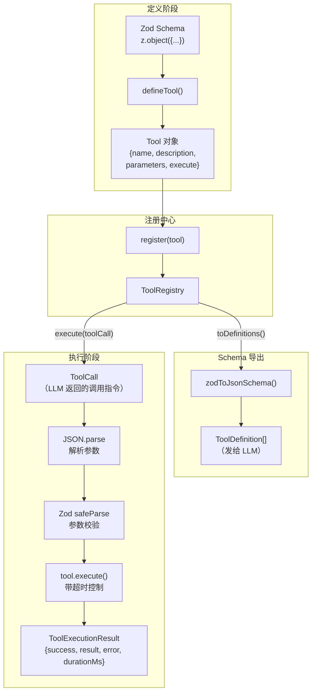
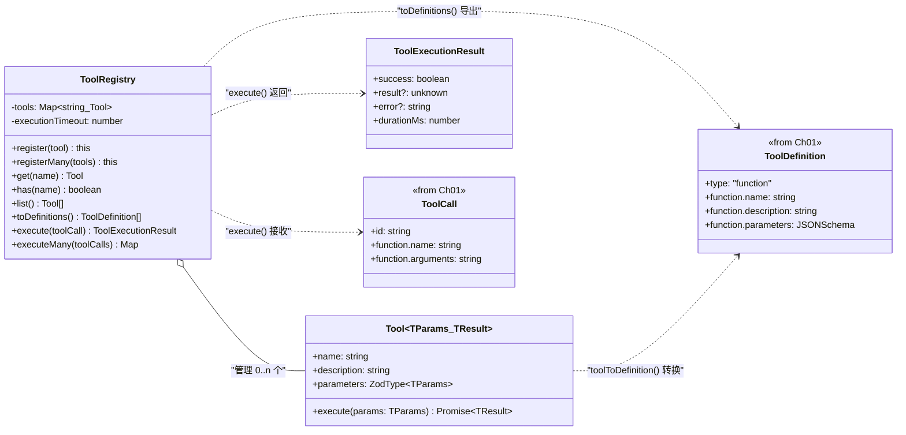
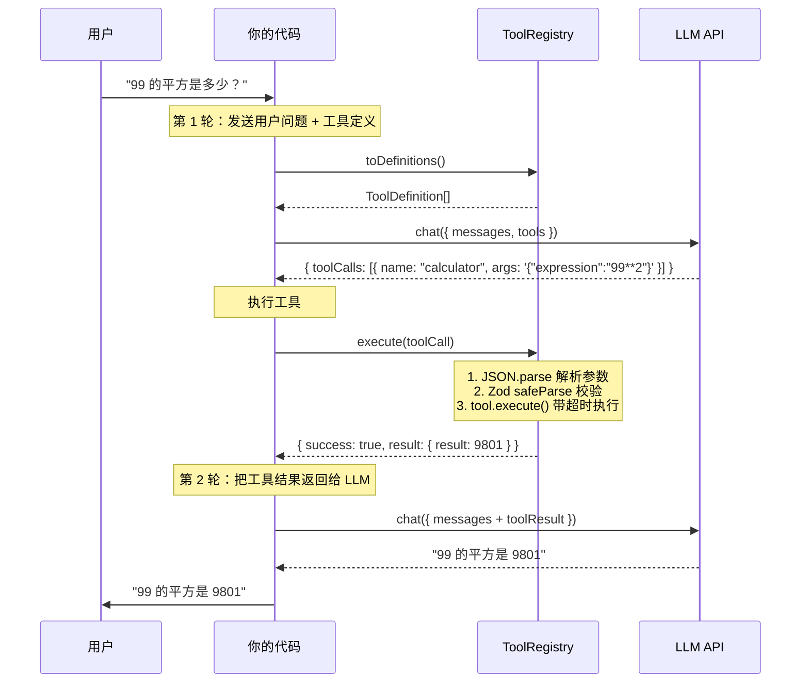

# Chapter 02: 给 Agent 装上双手 -- 工具系统

## 本章目标

学完本章，你将能够：

1. 理解 Function Calling 的完整协议流程
2. 用 Zod 定义类型安全的工具参数，并自动生成 JSON Schema
3. 实现一个工具注册中心（ToolRegistry），管理工具的注册、查找、Schema 导出
4. 实现工具执行沙箱（参数校验、超时控制、错误捕获）
5. 完成 LLM 选择工具 → 执行工具 → 返回结果 的手动循环

## 核心概念

### Function Calling 是什么

Function Calling（Anthropic 称为 Tool Use）是 LLM 的一种特殊能力：**LLM 不直接回答问题，而是告诉你"我需要调用某个函数来获取信息"**。

关键理解：LLM **不会**执行函数，它只是生成一个 JSON 格式的"调用指令"。实际执行函数是**你的代码**的责任。

```
用户: "北京今天天气怎么样？"

LLM 内部思考: 我不知道实时天气，但我有一个 get_weather 工具可以查
LLM 输出:  { tool_calls: [{ name: "get_weather", arguments: {"city": "北京"} }] }

你的代码: 调用天气 API，拿到结果 → 返回给 LLM
LLM 再输出: "北京今天晴，22°C。"
```

> 📖 权威参考:
> - [OpenAI Function Calling Guide](https://platform.openai.com/docs/guides/function-calling)
> - [Anthropic Tool Use](https://docs.anthropic.com/en/docs/build-with-claude/tool-use/overview)

### JSON Schema -- 工具的"说明书"

LLM 怎么知道有哪些工具可用、每个工具需要什么参数？答案是 **JSON Schema**。

你需要给 LLM 提供每个工具的 JSON Schema 描述，它包含：
- `name`：工具名称（LLM 用这个名字来"点名"）
- `description`：工具功能描述（这是 **Prompt Engineering** 的一部分！描述写得好不好直接影响 LLM 是否能正确使用工具）
- `parameters`：参数的 JSON Schema（告诉 LLM 需要传什么参数）

```json
{
  "type": "function",
  "function": {
    "name": "get_weather",
    "description": "获取指定城市的当前天气信息",
    "parameters": {
      "type": "object",
      "properties": {
        "city": {
          "type": "string",
          "description": "城市名称，如'北京'、'上海'"
        }
      },
      "required": ["city"]
    }
  }
}
```

### 为什么用 Zod

手写 JSON Schema 又繁琐又容易出错。Zod 可以一石三鸟：

| 能力 | Zod 提供 | 手写 JSON Schema |
|------|----------|-----------------|
| 运行时参数校验 | `schema.safeParse(data)` | 需要额外的校验库 |
| TypeScript 类型推导 | `z.infer<typeof schema>` | 需要手动定义接口 |
| 生成 JSON Schema | `zodToJsonSchema(schema)` | 就是 JSON Schema 本身 |
| description 标注 | `.describe('说明')` | 手写 `"description"` 字段 |

一份 Zod Schema 同时满足三个需求，这是工具系统选择 Zod 的核心原因。

## 架构设计

### 图 1: 工具系统整体架构

> **这张图回答的问题**：工具系统由哪些组件构成？数据在它们之间如何流动？
>
> **怎么读**：左侧是"定义阶段"（开发时），右侧是"运行阶段"（执行时）。`ToolRegistry` 是连接两个阶段的中枢。



### 图 2: 类型关系图

> 本章新增的类型（红色边框）和 Chapter 01 已有类型的关系。



### 图 3: 一次完整的工具调用流程

> 从用户提问到最终回复的完整时序。这个手动过程就是 Chapter 03 ReAct 循环要自动化的逻辑。



## 逐步实现

### 第一步：Tool 定义与 defineTool

**文件: `src/tools/tool.ts`**

核心设计：一个 Tool 就是一个包含 4 个字段的对象：

```typescript
export interface Tool<TParams = unknown, TResult = unknown> {
  name: string;                              // 工具名（LLM 通过这个名字调用）
  description: string;                       // 功能描述（影响 LLM 的选择决策）
  parameters: z.ZodType<TParams>;           // Zod Schema（参数校验 + 类型推导 + JSON Schema 导出）
  execute: (params: TParams) => Promise<TResult>;  // 实际执行函数
}
```

`defineTool` 是一个**辅助函数**，它什么逻辑都没有，只是为了获得更好的类型推导：

```typescript
export function defineTool<TParams, TResult>(
  config: Tool<TParams, TResult>
): Tool<TParams, TResult> {
  return config;
}
```

使用时，TypeScript 会自动从 Zod Schema 推导出 `execute` 函数的参数类型：

```typescript
const tool = defineTool({
  name: 'greet',
  description: '打招呼',
  parameters: z.object({
    name: z.string(),           // ← Zod 定义
    language: z.enum(['zh', 'en']),
  }),
  execute: async ({ name, language }) => {
    //             ^^^^^^  ^^^^^^^^
    //          string    "zh" | "en"  ← TypeScript 自动推导！
    return `Hello, ${name}!`;
  },
});
```

### 第二步：Zod → JSON Schema 转换

**文件: `src/tools/tool.ts` 中的 `zodToJsonSchema()`**

LLM API 需要 JSON Schema 格式的参数描述，而我们用 Zod 定义参数。需要一个转换器。

我们手写这个转换器而非使用 `zod-to-json-schema` 库，原因是：
1. Agent 场景只用到 JSON Schema 的一个子集（object、string、number、boolean、enum、array）
2. 手写让你理解 JSON Schema 的结构
3. 零外部依赖

核心逻辑是递归遍历 Zod Schema 的内部定义（`_def`），根据 `typeName` 映射到对应的 JSON Schema 类型：

```typescript
function convertZodType(schema: z.ZodType): Record<string, unknown> {
  const def = schema._def;
  const typeName = def.typeName;

  switch (typeName) {
    case 'ZodObject':   return convertZodObject(schema);  // → { type: "object", properties, required }
    case 'ZodString':   return { type: 'string' };
    case 'ZodNumber':   return { type: 'number' };
    case 'ZodBoolean':  return { type: 'boolean' };
    case 'ZodEnum':     return { type: 'string', enum: def.values };
    case 'ZodArray':    return { type: 'array', items: convertZodType(def.type) };
    case 'ZodOptional': return convertZodType(def.innerType);  // 解包，但不加入 required
    // ...
  }
}
```

关键细节：
- `.describe('说明')` 会被转换为 JSON Schema 的 `description` 字段
- `.optional()` 的字段不会出现在 `required` 数组中
- `.default()` 也视为可选

### 第三步：ToolRegistry -- 工具注册中心

**文件: `src/tools/registry.ts`**

ToolRegistry 是工具系统的核心枢纽，承担 4 个职责：

#### 3.1 注册与查找

```typescript
const registry = new ToolRegistry();
registry.register(calculatorTool);          // 单个注册
registry.registerMany([tool1, tool2]);      // 批量注册
registry.get('calculator');                 // 按名查找
registry.has('calculator');                 // 是否存在
registry.list();                            // 获取所有
```

重复注册会抛出错误，防止工具名冲突。

#### 3.2 Schema 导出

```typescript
const definitions = registry.toDefinitions();
// 直接传给 LLM API 的 tools 参数
const response = await provider.chat({ model, messages, tools: definitions });
```

#### 3.3 工具执行（带安全保护）

执行流程有 4 道防线：

```
ToolCall → ① 查找工具 → ② JSON.parse → ③ Zod 校验 → ④ 带超时执行
                ↓ 不存在        ↓ 无效JSON      ↓ 参数不合法    ↓ 超时/异常
          友好错误信息     友好错误信息    详细校验错误   捕获异常
```

每一道防线失败都不会抛出异常，而是返回 `{ success: false, error: '...' }` -- 这样 Agent 可以把错误信息告诉 LLM，让它修正后重试。

#### 3.4 并行执行

当 LLM 一次返回多个 tool_calls 时（如同时查天气和计算），用 `executeMany` 并行执行：

```typescript
const results = await registry.executeMany(response.toolCalls);
// results 是 Map<toolCallId, ToolExecutionResult>
```

### 第四步：内置工具

**文件: `src/tools/builtin.ts`**

提供 4 个开箱即用的工具，同时作为自定义工具的范例：

| 工具 | 功能 | 教学价值 |
|------|------|----------|
| `calculatorTool` | 计算数学表达式 | 演示输入过滤、安全执行 |
| `currentTimeTool` | 获取当前时间 | 演示可选参数 |
| `jsonExtractTool` | JSON 路径提取 | 演示嵌套数据处理 |
| `stringTool` | 字符串操作 | 演示 enum 参数（多选操作类型）|

### 第五步：手动工具调用循环

目前还没有 Agent 循环（那是 Chapter 03 的事），我们先手动编排：

```typescript
// 1. 注册工具
const registry = new ToolRegistry();
registry.registerMany([calculatorTool, currentTimeTool]);

// 2. 发送请求（带工具定义）
const response = await provider.chat({
  model, messages,
  tools: registry.toDefinitions(),  // ← 告诉 LLM 有哪些工具
});

// 3. 如果 LLM 选择了工具
if (response.finishReason === 'tool_calls') {
  const results = await registry.executeMany(response.toolCalls!);

  // 4. 把工具结果加入消息历史
  for (const tc of response.toolCalls!) {
    const result = results.get(tc.id)!;
    messages.push({
      role: 'tool',
      toolCallId: tc.id,
      content: JSON.stringify(result.result),
    });
  }

  // 5. 再次发送请求，让 LLM 生成最终回复
  const finalResponse = await provider.chat({ model, messages, tools: registry.toDefinitions() });
  console.log(finalResponse.content);
}
```

这个手动过程就是 Chapter 03 要自动化的 ReAct 循环。

## 测试验证

### 运行单元测试

```bash
pnpm test
```

期望输出：

```
 ✓ src/tools/__tests__/tool.test.ts      (12 tests)   -- Zod→JSON Schema 转换
 ✓ src/tools/__tests__/registry.test.ts  (19 tests)   -- 注册、查找、执行、超时、并行
 ✓ src/tools/__tests__/builtin.test.ts   (17 tests)   -- 内置工具功能
 ✓ src/providers/__tests__/openai.test.ts    (17 tests)
 ✓ src/providers/__tests__/anthropic.test.ts (17 tests)

 Tests  82 passed (82)
```

### 运行集成测试

```bash
pnpm test:integration
```

工具集成测试验证的关键场景：

| 测试 | 验证内容 |
|------|---------|
| LLM 选择工具 | `toDefinitions()` 生成的 Schema LLM 能正确理解 |
| 完整循环 | 用户提问 → LLM 调用工具 → 执行 → 返回结果 → LLM 生成回复 |
| 多工具选择 | 注册多个工具时，LLM 能选择正确的那个 |

### 运行示例

```bash
# 工具基础用法（不需要 API Key）
pnpm example examples/02-tool-basics.ts

# 工具 + LLM 手动循环（需要 API Key）
pnpm example examples/02-tool-with-llm.ts
```

### 检查清单

- [ ] `pnpm test` 82 个测试全部通过
- [ ] `pnpm test:integration` 9 个集成测试全部通过
- [ ] 自定义工具能正确定义、注册、导出 Schema
- [ ] Zod optional 字段不出现在 JSON Schema 的 required 中
- [ ] 无效 JSON、参数校验失败、工具不存在都返回友好错误
- [ ] 超时工具被正确中断

## 思考题

1. **为什么工具执行失败时返回 `{ success: false, error }` 而不是直接抛出异常？**
   提示：思考 Agent 收到错误后应该做什么——是崩溃还是重试？

2. **为什么 `ToolCall.function.arguments` 是 JSON 字符串而非对象？如果 LLM 生成了无效 JSON 怎么办？**
   提示：思考流式场景下的 JSON 累积，以及 Registry 的第二道防线。

3. **工具描述（description）是 Prompt Engineering 的一部分——怎样写好工具描述能让 LLM 更准确地选择和使用工具？**
   提示：参考 [Anthropic 工具设计最佳实践](https://docs.anthropic.com/en/docs/build-with-claude/tool-use/best-practices)，关注"使用示例"和"边界说明"。

4. **如果两个工具的功能有重叠（如 calculatorTool 和一个 mathTool），LLM 可能会混淆。你会怎么解决？**
   提示：思考命名空间（Namespacing）策略。

## 关键文件清单

| 文件 | 说明 |
|------|------|
| `src/tools/tool.ts` | Tool 定义、defineTool、zodToJsonSchema、toolToDefinition |
| `src/tools/registry.ts` | ToolRegistry -- 注册、查找、Schema 导出、执行沙箱 |
| `src/tools/builtin.ts` | 4 个内置工具（calculator、current_time、json_extract、string_utils）|
| `src/tools/index.ts` | 工具模块导出 |
| `src/tools/__tests__/tool.test.ts` | Zod→JSON Schema 转换测试（12 个） |
| `src/tools/__tests__/registry.test.ts` | ToolRegistry 测试（19 个） |
| `src/tools/__tests__/builtin.test.ts` | 内置工具测试（17 个） |
| `src/tools/__tests__/integration.test.ts` | 工具 + LLM 集成测试（3 个） |
| `examples/02-tool-basics.ts` | 工具基础用法示例 |
| `examples/02-tool-with-llm.ts` | 工具 + LLM 手动循环示例 |

## 下一步

现在我们有了 Provider（大脑）和 Tools（双手），但每次工具调用还需要我们手动编排。在 [Chapter 03: Agent 的心脏 -- ReAct 循环](./chapter-03-react-loop.md) 中，我们将实现：

- ReAct（Reasoning + Acting）自动循环
- Agent 类的设计：把 Provider + Tools + System Prompt 封装为一个可直接使用的 Agent
- 终止条件（最大步数、LLM 主动终止、用户中断）
- 错误恢复与重试策略

那是从"工具集合"到"Agent 智能体"的关键跳跃。
