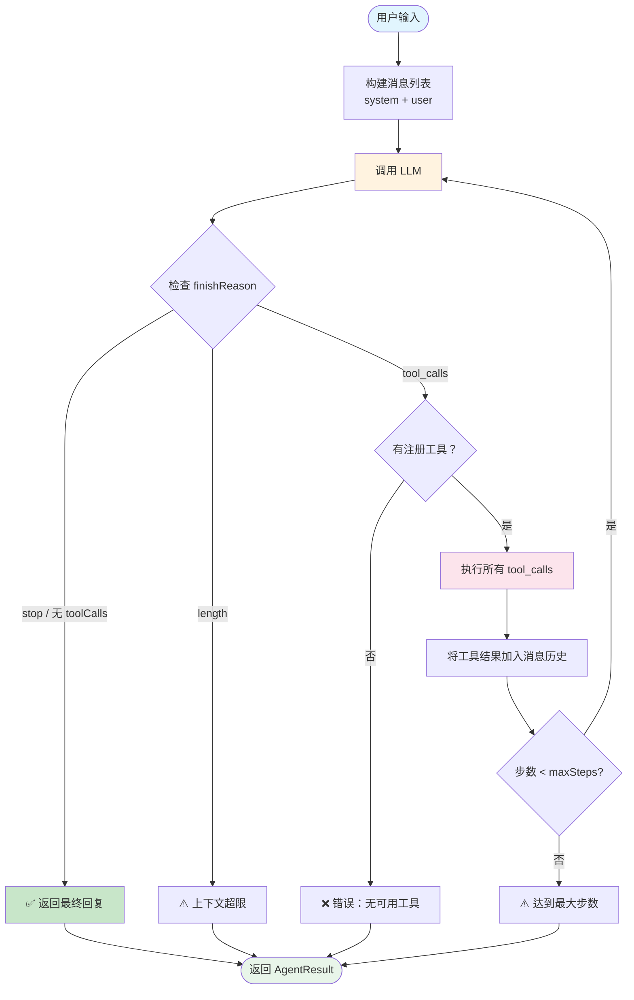
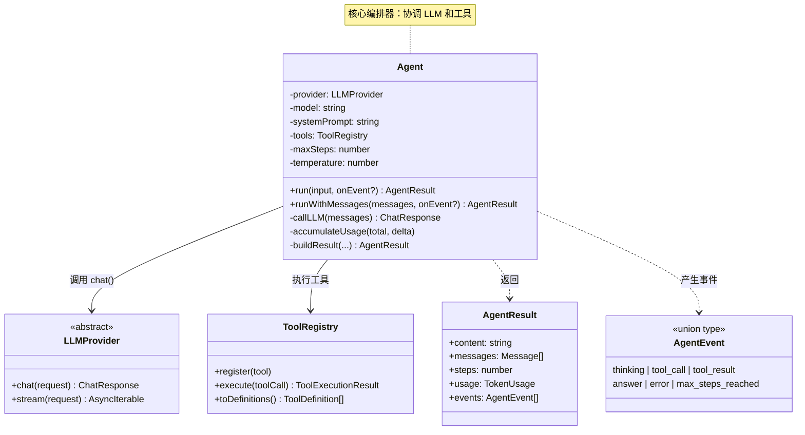
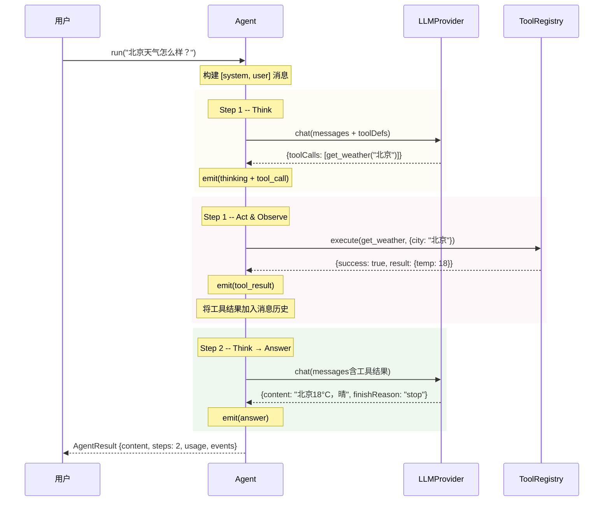

# Chapter 03: ReAct 循环 -- 让 Agent 真正"思考"

> **目标**：将 Chapter 01（Provider）和 Chapter 02（工具系统）组装成一个真正的 Agent，实现 ReAct 循环。

---

## 本章概览

| 你将学到 | 关键产出 |
|---------|---------|
| ReAct 论文的核心思想 | `Agent` 类 |
| Think → Act → Observe 循环 | 事件系统 `AgentEvent` |
| Agent 的终止条件设计 | 完整单元测试 + 集成测试 |
| 安全防护（最大步数） | 示例代码 |

---

## 3.1 什么是 ReAct？

### 3.1.1 论文背景

ReAct 来自 2023 年的论文 [ReAct: Synergizing Reasoning and Acting in Language Models](https://arxiv.org/abs/2210.03629)，核心思想只有一句话：

> **让 LLM 交替地 推理（Reasoning） 和 行动（Acting），而非只做其中一种。**

传统方法的问题：
- **纯推理（Chain-of-Thought）**：LLM 可以思考，但无法验证想法，容易产生幻觉
- **纯行动（Act-only）**：LLM 直接调用工具，但不解释为什么，难以纠错和追踪

ReAct 的解法是将两者交织：

```
Think:  "用户问北京天气，我需要调用天气工具"
Act:    get_weather(city="北京")
Observe: {"temp": 18, "condition": "晴"}
Think:  "获取到了天气数据，可以回复用户了"
Answer: "北京今天 18°C，晴天"
```

### 3.1.2 ReAct 在 Function Calling 时代的演化

论文原始的 ReAct 使用 Prompt 模板来引导 LLM 输出特定格式（`Thought:`, `Action:`, `Observation:`）。但现代 LLM 原生支持了 Function Calling / Tool Use 接口，ReAct 的实现变得更优雅：

| 原始 ReAct | Function Calling 时代 |
|-----------|---------------------|
| Prompt 模板解析 | 结构化 `tool_calls` JSON |
| 需要 regex 提取动作 | API 直接返回 `function.name` + `function.arguments` |
| 输出格式不稳定 | 100% 可靠的结构化输出 |
| 需要自定义停止词 | `finish_reason: "tool_calls"` |

我们的 TinyAgent 采用后者——通过 `finish_reason` 和 `tool_calls` 实现 ReAct 循环。

### 3.1.3 官方参考

- ReAct 论文：https://arxiv.org/abs/2210.03629
- OpenAI Function Calling 指南：https://platform.openai.com/docs/guides/function-calling
- Anthropic Tool Use 文档：https://docs.anthropic.com/en/docs/build-with-claude/tool-use

---

## 3.2 架构设计

### 3.2.1 ReAct 循环流程图



**关键设计决策**：
1. **3 种终止条件**：正常回复、上下文超限、最大步数。确保循环一定会结束。
2. **顺序执行工具**：当前实现按顺序执行每个 tool_call。LLM 一次可以返回多个 tool_calls（并行工具调用），它们的结果会依次加入消息历史。
3. **错误不中断循环**：工具执行失败不会终止 Agent，而是将错误信息反馈给 LLM，让其决定如何恢复。

### 3.2.2 Agent 组件关系图



**要点**：
- `Agent` 是一个**编排器（Orchestrator）**，它本身不做推理，也不执行动作，只负责协调 `LLMProvider` 和 `ToolRegistry`
- `AgentEvent` 是事件系统的基础，为后续的可观测性（Chapter 10）埋下伏笔
- `AgentResult` 记录完整的执行过程，便于审计和调试

### 3.2.3 一次完整 ReAct 循环的时序图



---

## 3.3 核心类型设计

### 3.3.1 AgentOptions -- Agent 配置

```typescript
export interface AgentOptions {
  provider: LLMProvider;       // 使用的 LLM Provider
  model: string;               // 模型名称
  systemPrompt: string;        // 定义 Agent 的身份和行为
  tools?: ToolRegistry;        // 工具注册中心（可选）
  maxSteps?: number;           // 最大步数，默认 10
  temperature?: number;        // 默认 0（确定性输出）
  maxTokens?: number;          // 最大输出 token
}
```

**设计思考**：
- `tools` 是可选的：没有工具的 Agent 就是纯对话。这保持了灵活性。
- `maxSteps` 默认 10：这是安全阀。生产环境中，要根据任务复杂度调整。
- `temperature` 默认 0：Agent 做决策时需要确定性，避免随机调用错误的工具。

### 3.3.2 AgentEvent -- 事件类型

```typescript
export type AgentEvent =
  | { type: 'thinking';   step: number; content: string | null }
  | { type: 'tool_call';  step: number; toolName: string; arguments: string; toolCallId: string }
  | { type: 'tool_result'; step: number; toolCallId: string; result: ToolExecutionResult }
  | { type: 'answer';     step: number; content: string }
  | { type: 'error';      step: number; error: string }
  | { type: 'max_steps_reached'; step: number };
```

使用 **辨别联合类型（Discriminated Union）** 来定义事件，TypeScript 可以在 `switch (event.type)` 中自动推断具体类型。这是 TypeScript 中非常常见且强大的模式。

### 3.3.3 AgentResult -- 运行结果

```typescript
export interface AgentResult {
  content: string;          // 最终回复
  messages: Message[];      // 完整消息历史
  steps: number;            // 执行步数
  usage: TokenUsage;        // 累计 Token 用量
  events: AgentEvent[];     // 所有事件
}
```

为什么要返回这么多信息？
- `messages`：支持**多轮对话**——你可以把 messages 传回下一次 `runWithMessages()`
- `usage`：**成本监控**——累计多轮 LLM 调用的 token 消耗
- `events`：**可观测性**——记录 Agent 的每一步决策，便于调试和审计

---

## 3.4 实现步骤

### Step 1: 创建 `src/agent.ts`

Agent 类的核心结构：

```typescript
export class Agent {
  private provider: LLMProvider;
  private model: string;
  private systemPrompt: string;
  private tools: ToolRegistry | undefined;
  private maxSteps: number;
  private temperature: number;
  private maxTokens: number | undefined;

  constructor(options: AgentOptions) {
    this.provider = options.provider;
    this.model = options.model;
    this.systemPrompt = options.systemPrompt;
    this.tools = options.tools;
    this.maxSteps = options.maxSteps ?? 10;
    this.temperature = options.temperature ?? 0;
    this.maxTokens = options.maxTokens;
  }
}
```

### Step 2: 实现 `run()` -- ReAct 循环核心

`run()` 方法是整个框架的心脏。伪代码如下：

```
function run(input):
    messages = [system, user(input)]
    step = 0

    while step < maxSteps:
        step++

        response = LLM.chat(messages)      // Think

        if response.finishReason == 'stop':
            return response.content         // Answer

        for each toolCall in response.toolCalls:
            result = tools.execute(toolCall)  // Act
            messages.append(result)           // Observe

    return "达到最大步数"
```

实际实现的关键代码片段：

```typescript
async run(input: string, onEvent?: (event: AgentEvent) => void): Promise<AgentResult> {
    const messages: Message[] = [
      { role: 'system', content: this.systemPrompt },
      { role: 'user', content: input },
    ];

    // ...初始化...

    while (step < this.maxSteps) {
      step++;

      // Think: 调用 LLM
      const response = await this.callLLM(messages);
      this.accumulateUsage(totalUsage, response.usage);

      // 终止条件: 直接回复
      if (response.finishReason === 'stop' || !response.toolCalls?.length) {
        emit({ type: 'answer', step, content: response.content ?? '' });
        return this.buildResult(content, messages, step, totalUsage, events);
      }

      // Act: 执行工具
      for (const toolCall of response.toolCalls!) {
        emit({ type: 'tool_call', step, ... });
        const execResult = await this.tools!.execute(toolCall);
        emit({ type: 'tool_result', step, ... });

        // Observe: 结果加入历史
        messages.push({
          role: 'tool',
          toolCallId: toolCall.id,
          content: JSON.stringify(execResult.result),
        });
      }
    }

    // 安全终止
    return "达到最大步数";
}
```

### Step 3: 实现事件系统

事件系统非常简单但极其重要：

```typescript
const events: AgentEvent[] = [];
const emit = (event: AgentEvent) => {
    events.push(event);        // 1. 记录到结果中
    onEvent?.(event);          // 2. 实时回调
};
```

两层设计：
1. **`events` 数组**：事后审计和调试
2. **`onEvent` 回调**：实时观测，用于 UI 展示、日志记录

这个简单的设计在后续章节会扩展为完整的可观测性系统。

### Step 4: 更新 `src/index.ts`

```typescript
export { Agent } from './agent.js';
export type { AgentOptions, AgentResult, AgentEvent } from './agent.js';
```

---

## 3.5 错误处理策略

Agent 的错误处理是一个重要的设计决策。我们采用**错误不中断**的策略：

| 错误场景 | 处理方式 | 原因 |
|---------|---------|------|
| LLM 调用失败 | 捕获异常，返回错误结果 | 网络问题不应崩溃整个程序 |
| 工具不存在 | 错误消息反馈给 LLM | LLM 可能自行纠正 |
| 工具参数验证失败 | 错误消息反馈给 LLM | LLM 可能修正参数后重试 |
| 工具执行抛异常 | 错误消息反馈给 LLM | LLM 可能换个工具 |
| 上下文超长 | 返回截断提示 | 告知用户需要缩短输入 |
| 超过最大步数 | 强制终止 | 安全阀，防止成本失控 |

**关键原则**：工具错误是"可恢复的"，而非"致命的"。把错误告知 LLM，让它决定如何恢复——这正是 Agent 区别于传统程序的地方。

---

## 3.6 测试验证

### 3.6.1 单元测试

本章编写了 12 个单元测试，使用 mock Provider 覆盖所有路径：

```bash
npx vitest run src/__tests__/agent.test.ts
```

| 测试分组 | 测试数 | 覆盖内容 |
|---------|--------|---------|
| 纯对话 | 1 | 1 步直接回复 |
| 单工具调用 | 2 | ReAct 循环 + 结果序列化 |
| 多步工具调用 | 1 | 连续 3 轮工具调用 |
| 并行工具调用 | 1 | 一次返回多个 tool_calls |
| 工具执行失败 | 1 | 错误反馈给 LLM |
| 最大步数限制 | 1 | maxSteps 安全阀 |
| LLM 调用失败 | 1 | 网络错误捕获 |
| 事件回调 | 2 | 事件顺序 + 一致性 |
| Token 用量累计 | 1 | 多轮 usage 累加 |
| 边界情况 | 1 | 无工具但收到 tool_calls |

### 3.6.2 集成测试

4 个集成测试验证与真实 LLM API 的端到端工作：

```bash
npx vitest run src/__tests__/agent.integration.test.ts
```

| 测试 | 验证内容 |
|------|---------|
| 纯对话 | 基本交互 + 回复质量 |
| 工具调用循环 | 完整 ReAct 流程 |
| 多工具选择 | LLM 从多个工具中正确选择 |
| 事件流 | onEvent 回调实时触发 |

### 3.6.3 运行全部测试

```bash
# 只跑单元测试（不需要 API Key）
npx vitest run --exclude '**/integration*'

# 跑全部测试（需要配置 .env）
npx vitest run
```

---

## 3.7 示例代码

### 3.7.1 最简 Agent

```typescript
// examples/03-agent-basic.ts
import { Agent, OpenAIProvider } from '../src/index.js';

const agent = new Agent({
  provider: new OpenAIProvider({ apiKey, baseUrl, defaultModel }),
  model: 'gpt-4o-mini',
  systemPrompt: '你是一个友好的中文助手。',
});

const result = await agent.run('什么是 ReAct？');
console.log(result.content);
```

### 3.7.2 带工具的 ReAct Agent

```typescript
// examples/03-react-loop.ts
const agent = new Agent({
  provider,
  model,
  systemPrompt: '你是智能助手，可以查天气和做计算。',
  tools,       // 注册了 get_weather 和 calculator
  maxSteps: 5,
});

const result = await agent.run(
  '深圳天气多少度？如果明天降温5度呢？',
  (event) => console.log(formatEvent(event))  // 实时观测
);
```

运行示例：

```bash
npx tsx examples/03-react-loop.ts
```

---

## 3.8 深入思考

### 3.8.1 ReAct vs Plan-and-Execute

ReAct 是逐步推理（step-by-step），每步只看当前状态。另一种范式是 **Plan-and-Execute**：

```
Plan:    1. 查北京天气  2. 查上海天气  3. 比较两者
Execute: 依次执行每个步骤
```

| | ReAct | Plan-and-Execute |
|-|-------|-----------------|
| 优势 | 灵活、可随时调整 | 全局视野、步骤清晰 |
| 劣势 | 可能走弯路 | 计划可能过时、僵化 |
| 适合 | 简单到中等任务 | 复杂多步骤任务 |

在 Chapter 07（Multi-Agent）中，我们会实现 Plan-and-Execute 模式。

### 3.8.2 温度（Temperature）的影响

我们默认 `temperature = 0`，原因：

- **Agent 需要确定性**：相同输入应产生相同的工具选择
- **避免随机错误**：temperature 高时，LLM 可能编造不存在的工具名
- **可重现性**：调试时需要可重现的行为

何时需要调高？
- 创意写作类 Agent（brainstorm、故事生成）
- 多样性搜索（exploration vs exploitation）

### 3.8.3 maxSteps 该设多少？

| 场景 | 建议 maxSteps | 原因 |
|------|-------------|------|
| 简单问答 + 1 个工具 | 3-5 | 1 轮工具调用足够 |
| 复杂数据分析 | 10-15 | 可能需要多轮查询和计算 |
| 代码生成 + 测试 | 15-20 | 编写 → 运行 → 修复 循环 |
| 自主研究 Agent | 20-30 | 搜索 → 阅读 → 总结 多轮 |

**生产建议**：设置 maxSteps 同时监控实际步数。如果 Agent 经常达到上限，说明任务太复杂或 prompt 需要优化。

### 3.8.4 为什么不用并行执行工具？

当前实现中，一轮中的多个 tool_calls 是顺序执行的。这是有意为之：

1. **简单可靠**：顺序执行逻辑清晰，便于调试
2. **错误隔离**：一个工具失败不影响其他工具的执行
3. **日志清晰**：事件按时间顺序排列

如果需要并行执行（性能敏感场景），`ToolRegistry.executeMany()` 已经在 Chapter 02 中实现了。你可以在 Agent 中用 `executeMany` 替换顺序循环来获得并行执行能力。

---

## 3.9 与 Chapter 01-02 的关系

```mermaid
graph LR
    Ch01[Chapter 01<br/>LLM Provider] -->|chat() 接口| Agent
    Ch02[Chapter 02<br/>工具系统] -->|execute() + toDefinitions()| Agent
    Agent -->|AgentResult| Ch06[Chapter 06<br/>流式输出]
    Agent -->|AgentEvent| Ch10[Chapter 10<br/>可观测性]
    Agent -->|messages| Ch04[Chapter 04<br/>记忆系统]
    Agent -->|run()| Ch07[Chapter 07<br/>Multi-Agent]

    style Agent fill:#ffeb3b,stroke:#f57f17,stroke-width:2px
```

Agent 是框架的**中心枢纽**：
- 向下：组合使用 Provider 和 Tools
- 向上：为记忆、流式、Multi-Agent、可观测性提供扩展点

---

## 3.10 关键文件清单

| 文件 | 说明 | 行数 |
|------|------|------|
| `src/agent.ts` | Agent 核心实现 | ~270 |
| `src/__tests__/agent.test.ts` | 12 个单元测试 | ~300 |
| `src/__tests__/agent.integration.test.ts` | 4 个集成测试 | ~130 |
| `examples/03-agent-basic.ts` | 纯对话示例 | ~30 |
| `examples/03-react-loop.ts` | ReAct 循环示例 | ~100 |

---

## 3.11 本章小结

本章我们实现了 TinyAgent 框架的核心——`Agent` 类。它只有约 270 行代码，但做了三件关键的事：

1. **ReAct 循环**：Think → Act → Observe → Answer 的完整闭环
2. **安全防护**：三重终止条件（正常回复、上下文超限、最大步数），确保永远不会无限循环
3. **事件系统**：每一步都产生结构化事件，为可观测性和调试打下基础

**下一章预告**：Chapter 04 将实现**记忆系统**——让 Agent 拥有短期记忆和长期记忆，能在多轮对话中保持上下文，甚至跨会话记住重要信息。
