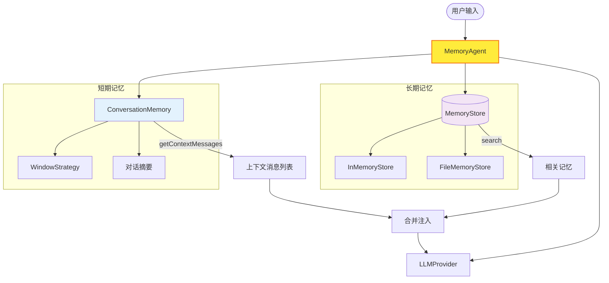
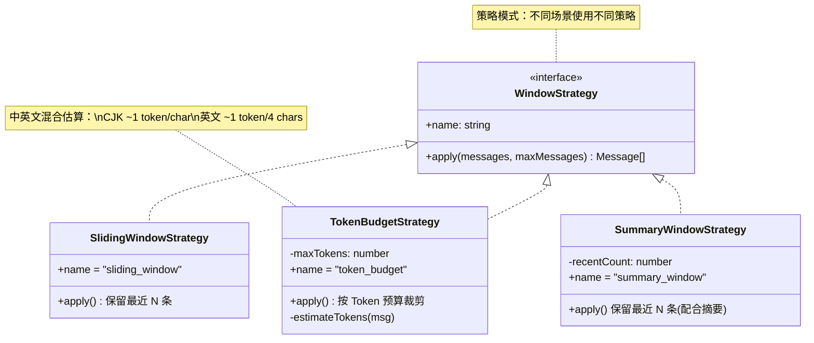
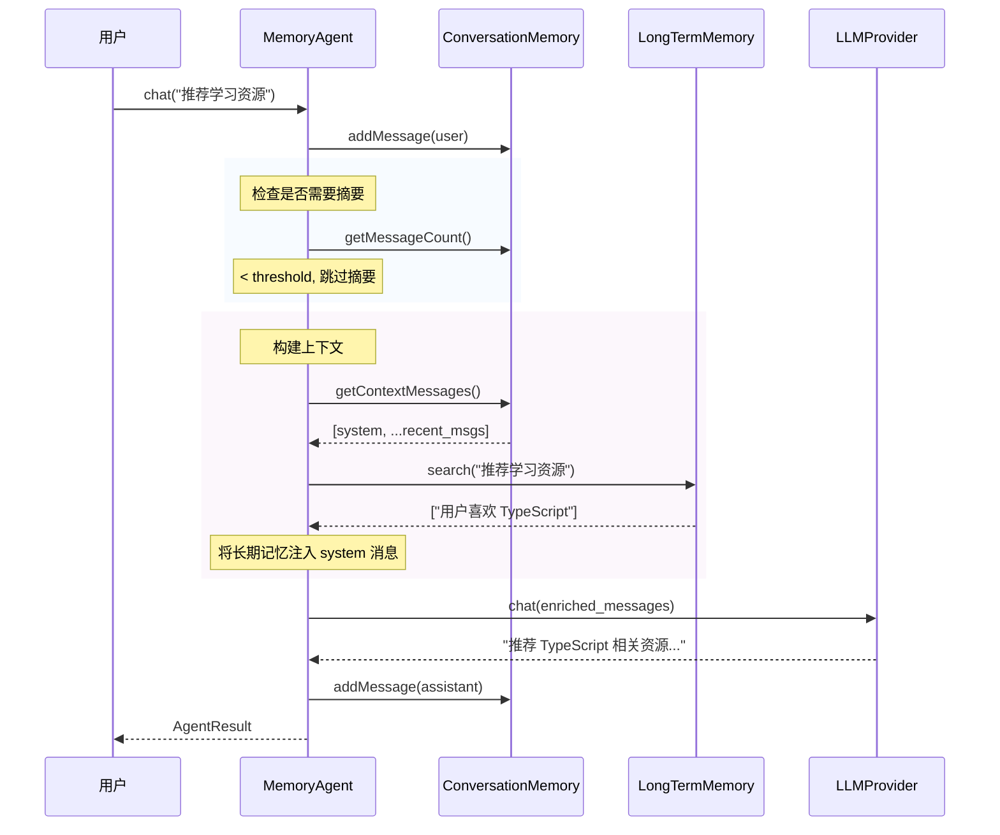
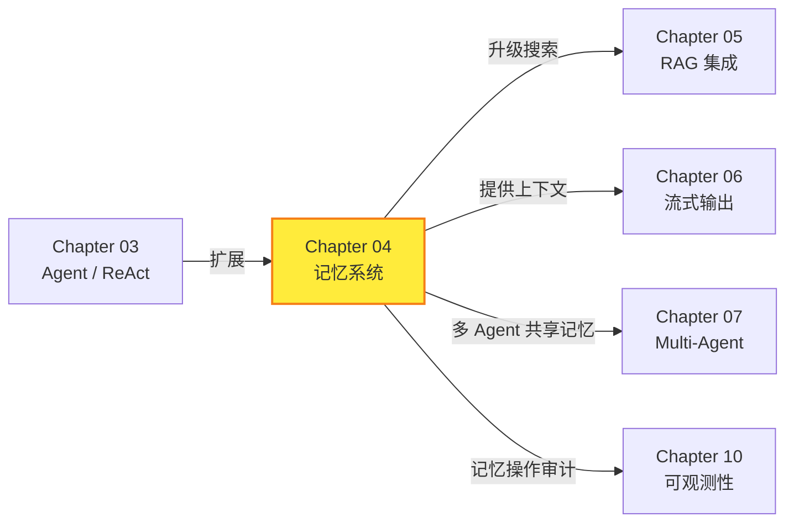

# Chapter 04: 记忆系统 -- 让 Agent 拥有记忆

> **目标**：为 Agent 添加短期记忆（对话上下文管理）和长期记忆（跨会话持久化），让 Agent 能在多轮对话中保持连贯、跨会话记住重要信息。

---

## 本章概览

| 你将学到 | 关键产出 |
|---------|---------|
| Agent 记忆的分类与层次 | `ConversationMemory` 短期记忆 |
| 对话窗口策略（滑动窗口 / Token 预算） | `MemoryStore` 长期记忆接口 |
| 对话摘要压缩 | `InMemoryStore` + `FileMemoryStore` |
| 长期记忆的存取与检索 | `MemoryAgent` 带记忆的 Agent |
| 关键词分词搜索 | 完整单元测试 + 集成测试 |

---

## 4.1 为什么 Agent 需要记忆？

### 4.1.1 LLM 的"失忆"问题

LLM 本身是**无状态**的——每次 API 调用是独立的，模型不记得上一次你问了什么。我们在 Chapter 03 中让 Agent 工作起来了，但 `Agent.run()` 每次调用都从头开始。

想象一个真实场景：

```
用户: 我叫小明            ← 第 1 次调用 Agent.run()
Agent: 你好小明！

用户: 我叫什么？          ← 第 2 次调用 Agent.run()
Agent: 对不起，我不知道你叫什么。  ← 😱 失忆了！
```

这是因为第 2 次调用时，消息列表只有 `[system, "我叫什么？"]`，Agent 根本不知道你之前说过你叫小明。

### 4.1.2 记忆的分层

参考人类记忆的心理学模型，Agent 的记忆可以分为：

| 记忆类型 | 类比 | 说明 | 实现 |
|---------|------|------|------|
| **短期记忆** | 工作记忆 | 当前对话的上下文 | 消息列表 + 窗口策略 |
| **长期记忆** | 语义记忆 | 跨会话的事实和偏好 | 持久化存储 + 检索 |
| **情景记忆** | 回忆 | 过去对话的摘要 | 对话摘要压缩 |

> 参考：[LangChain Memory 文档](https://python.langchain.com/docs/modules/memory/)、[Letta (MemGPT) 论文](https://arxiv.org/abs/2310.08560)

### 4.1.3 核心挑战

记忆系统面临的核心矛盾是 **上下文窗口有限** vs **信息越多越好**：

- GPT-4o 上下文窗口：128K tokens（约 10 万中文字）
- 但 Token 越多 → 成本越高 → 延迟越大 → 注意力越分散

**解决方案**：不是把所有历史都塞进去，而是智能地选择最相关的信息。

---

## 4.2 架构设计

### 4.2.1 记忆系统整体架构



**核心流程**：
1. 用户发送消息 → `MemoryAgent.chat()`
2. 短期记忆通过窗口策略裁剪消息历史
3. 长期记忆搜索与当前对话相关的信息
4. 两者合并注入 system 消息，发送给 LLM

### 4.2.2 窗口策略类图



### 4.2.3 MemoryAgent 时序图



---

## 4.3 核心类型设计

### 4.3.1 MemoryEntry -- 长期记忆的基本单元

```typescript
export interface MemoryEntry {
  id: string;               // 唯一标识
  content: string;           // 记忆内容
  metadata: Record<string, unknown>;  // 元数据（来源、标签等）
  createdAt: number;         // 创建时间
  lastAccessedAt: number;    // 最后访问时间（用于 LRU 策略）
  importance: number;        // 重要性评分 0-1
}
```

**设计决策**：
- `importance`：区分关键信息和普通信息。用户姓名（0.9）比闲聊（0.3）更重要，淘汰时优先保留高重要性的条目
- `lastAccessedAt`：结合重要性，支持 LRU（Least Recently Used）淘汰策略
- `metadata`：灵活的元数据，可以标记来源（`conversation`/`tool`/`manual`）、标签等

### 4.3.2 MemoryStore -- 存储接口

```typescript
export interface MemoryStore {
  readonly name: string;
  add(entry): Promise<MemoryEntry>;
  get(id: string): Promise<MemoryEntry | null>;
  search(query: string, limit?: number): Promise<MemoryEntry[]>;
  list(): Promise<MemoryEntry[]>;
  delete(id: string): Promise<boolean>;
  clear(): Promise<void>;
  size(): Promise<number>;
}
```

**接口全部异步**：即使 `InMemoryStore` 不需要异步，接口也统一用 `Promise`。这样切换到 `FileMemoryStore` 或未来的数据库实现时，调用方无需修改。

### 4.3.3 WindowStrategy -- 窗口策略接口

```typescript
export interface WindowStrategy {
  readonly name: string;
  apply(messages: Message[], maxMessages: number): Message[];
}
```

**策略模式**：不同场景使用不同策略，Agent 无需关心具体裁剪逻辑。

---

## 4.4 实现步骤

### Step 1: 窗口策略 -- `src/memory/window-strategies.ts`

#### 滑动窗口（最简单）

```typescript
export class SlidingWindowStrategy implements WindowStrategy {
  apply(messages: Message[], maxMessages: number): Message[] {
    if (maxMessages <= 0) return [];
    if (messages.length <= maxMessages) return messages;
    return messages.slice(-maxMessages);
  }
}
```

**核心思想**：只保留最近 N 条消息。简单粗暴但有效。
**陷阱**：`slice(-0)` 返回全部数组，所以必须特判 `maxMessages <= 0`。

#### Token 预算策略（按成本裁剪）

```typescript
export class TokenBudgetStrategy implements WindowStrategy {
  apply(messages: Message[], _maxMessages: number): Message[] {
    let tokenCount = 0;
    const result: Message[] = [];

    // 从最新消息开始，向前累计
    for (let i = messages.length - 1; i >= 0; i--) {
      const msgTokens = this.estimateTokens(messages[i]!);
      if (tokenCount + msgTokens > this.maxTokens) break;
      tokenCount += msgTokens;
      result.unshift(messages[i]!);
    }
    return result;
  }
}
```

**为什么从后往前**？最新的消息通常最重要，优先保留。

#### Token 估算

```typescript
export function estimateTokenCount(text: string): number {
  let count = 0;
  for (const char of text) {
    const code = char.codePointAt(0) ?? 0;
    if (isCJK(code)) count += 1;     // CJK 字符：~1 token/char
    else count += 0.25;               // 英文字符：~1 token/4 chars
  }
  return Math.ceil(count) + 4;        // +4 message overhead
}
```

**注意**：这是近似值。精确计算需要 [tiktoken](https://github.com/openai/tiktoken)（Python）或 [js-tiktoken](https://github.com/dqbd/tiktoken)（JS）。在教学框架中，近似值已经足够好。

### Step 2: 对话记忆 -- `src/memory/conversation-memory.ts`

`ConversationMemory` 的核心方法是 `getContextMessages()`：

```typescript
getContextMessages(): Message[] {
    // 1. 窗口策略裁剪
    const windowed = this.windowStrategy.apply(this.messages, this.maxMessages);

    // 2. 构建 system 消息（含摘要）
    let systemContent = this.systemPrompt;
    if (this.summary) {
      systemContent += `\n\n[Previous conversation summary]\n${this.summary.content}`;
    }

    // 3. 组装
    return [{ role: 'system', content: systemContent }, ...windowed];
}
```

**摘要注入**：当对话过长被裁剪时，早期消息的信息通过摘要"压缩"后注入 system 消息。这样 LLM 仍然知道之前聊了什么，但不会消耗过多 token。

### Step 3: 长期记忆存储 -- `src/memory/memory-store.ts`

#### 关键词分词搜索

搜索不是简单的子串匹配，而是分词后关键词匹配：

```typescript
function tokenize(text: string): string[] {
  return text
    .toLowerCase()
    .split(/[\s,.!?;:'"()\[\]{}<>\/\\]+/)
    .filter((w) => w.length > 1 && !STOP_WORDS.has(w));
}
```

**停用词过滤**：去除 `the`, `is`, `a` 等无意义词汇，提高搜索精度。

**排序公式**：

```
score = matchScore × 0.4 + importance × 0.4 + recency × 0.2
```

三个因子：
- **matchScore**：查询关键词命中比例
- **importance**：条目的重要性评分
- **recency**：最后访问时间（越近越高）

> **Chapter 05 预告**：这里的关键词搜索将升级为向量相似度搜索（RAG），通过 Embedding 实现语义级别的记忆检索。

#### 文件持久化

`FileMemoryStore` 使用 JSON 文件存储，支持 lazy loading：

```typescript
private async ensureLoaded(): Promise<void> {
    if (this.loaded) return;
    try {
      const data = await readFile(this.filePath, 'utf-8');
      const parsed = JSON.parse(data) as MemoryEntry[];
      for (const entry of parsed) this.entries.set(entry.id, entry);
    } catch {
      // 文件不存在则从空开始
    }
    this.loaded = true;
}
```

**Lazy Loading 模式**：首次操作时才加载文件，避免构造函数异步问题。

### Step 4: 带记忆的 Agent -- `src/memory/memory-agent.ts`

`MemoryAgent` 在 `Agent` 的基础上增加了三个关键能力：

#### 1. 自动上下文管理

```typescript
async chat(input: string): Promise<AgentResult> {
    this.memory.addMessage({ role: 'user', content: input });
    await this.maybeSummarize();
    const contextMessages = await this.buildContextWithLongTermMemory(input);
    // ... ReAct 循环 ...
    this.memory.addMessage({ role: 'assistant', content });
    return result;
}
```

与 `Agent.run()` 不同，`MemoryAgent.chat()` 会自动管理消息历史——你只需要一直调用 `chat()`，它会记住所有对话。

#### 2. 长期记忆注入

```typescript
private async buildContextWithLongTermMemory(query: string): Promise<Message[]> {
    const contextMessages = this.memory.getContextMessages();
    if (!this.longTermMemory) return contextMessages;

    const memories = await this.longTermMemory.search(query, 3);
    if (memories.length === 0) return contextMessages;

    // 注入 system 消息
    const memoryText = memories.map((m) => `- ${m.content}`).join('\n');
    const enriched = {
      role: 'system',
      content: `${system.content}\n\n[Relevant memories]\n${memoryText}`,
    };
    return [enriched, ...contextMessages.slice(1)];
}
```

#### 3. 自动摘要压缩

```typescript
private async maybeSummarize(): Promise<void> {
    if (this.memory.getMessageCount() < this.summaryThreshold) return;

    const toSummarize = this.memory.prepareForSummarization(this.summaryKeepRecent);
    const summaryText = await this.generateSummary(toSummarize);
    this.memory.setSummary(summaryText, toSummarize.length);
}
```

当消息数超过阈值（默认 16），自动用 LLM 生成摘要，保留最近 6 条消息，其余压缩为摘要注入 system 消息。

---

## 4.5 测试验证

### 4.5.1 单元测试

本章编写了 62 个单元测试，覆盖 4 个模块：

```bash
npx vitest run src/memory/__tests__/
```

| 测试文件 | 测试数 | 覆盖内容 |
|---------|--------|---------|
| `window-strategies.test.ts` | 14 | 3 种窗口策略 + Token 估算 |
| `conversation-memory.test.ts` | 13 | 消息管理 + 上下文构建 + 摘要 + Prompt 更新 |
| `memory-store.test.ts` | 26 | InMemoryStore + FileMemoryStore（通用套件 + 持久化） |
| `memory-agent.test.ts` | 9 | 基础对话 + 工具 + 长期记忆 + 自动摘要 + 会话管理 |

**测试设计亮点**：`memory-store.test.ts` 使用了**参数化测试套件**（`storeTestSuite`），同一组测试对 `InMemoryStore` 和 `FileMemoryStore` 各运行一次，确保两种实现行为一致。

### 4.5.2 集成测试

3 个集成测试验证与真实 LLM API 的端到端工作：

| 测试 | 验证内容 |
|------|---------|
| 多轮对话保持上下文 | 第 2 轮应记住第 1 轮告知的名字 |
| 长期记忆影响回复 | 存储的用户偏好应体现在推荐中 |
| 重置后丢失短期记忆 | 清空对话后不应记得之前的信息 |

---

## 4.6 深入思考

### 4.6.1 记忆一致性问题

当长期记忆与当前对话矛盾时怎么办？

```
长期记忆: 用户住在北京
用户:     我刚搬到上海了
```

**常见策略**：
1. **时效优先**：最新信息覆盖旧信息（更新长期记忆）
2. **共存**：两条记忆都保留，由 LLM 判断哪个更相关
3. **显式确认**：Agent 主动询问"您之前住在北京，是搬家了吗？"

我们当前实现采用方案 2（共存），后续可通过记忆更新机制支持方案 1。

### 4.6.2 记忆的成本

| 操作 | 额外成本 |
|------|---------|
| 短期记忆窗口 | 消息列表裁剪，几乎零成本 |
| 对话摘要 | 每次触发 1 次额外 LLM 调用（~200 tokens） |
| 长期记忆搜索 | 内存操作，零 API 成本 |
| 长期记忆注入 | 增加 system 消息长度（~100 tokens） |

**优化建议**：
- 摘要阈值不要太低，避免频繁触发
- 长期记忆注入限制 top-3，避免塞入过多无关信息
- 生产环境可以用更便宜的模型做摘要

### 4.6.3 ConversationMemory vs Agent.runWithMessages()

| | ConversationMemory | runWithMessages() |
|-|-------------------|-------------------|
| 管理方式 | 自动 | 手动 |
| 窗口裁剪 | 内置 | 需要自行实现 |
| 摘要压缩 | 内置 | 需要自行实现 |
| 长期记忆 | 内置 | 无 |
| 适合场景 | 产品级应用 | 简单脚本、调试 |

**建议**：生产项目使用 `MemoryAgent`，原型和调试使用 `Agent`。

### 4.6.4 向量搜索 vs 关键词搜索

当前的 `MemoryStore.search()` 使用关键词分词匹配，有明显局限：

```
记忆: "用户喜欢 TypeScript"
查询: "推荐编程语言"  → ❌ 搜不到（没有重叠关键词）
```

向量搜索通过语义 Embedding 解决这个问题——Chapter 05（RAG）将实现：
- 纯 TypeScript 的余弦相似度计算
- 基于 Embedding API 的语义搜索
- 将 MemoryStore 升级为向量存储

---

## 4.7 与前后章节的关系



---

## 4.8 关键文件清单

| 文件 | 说明 | 行数 |
|------|------|------|
| `src/memory/types.ts` | 记忆系统核心类型 | ~80 |
| `src/memory/window-strategies.ts` | 3 种窗口策略 + Token 估算 | ~110 |
| `src/memory/conversation-memory.ts` | 短期记忆（对话上下文管理） | ~120 |
| `src/memory/memory-store.ts` | InMemoryStore + FileMemoryStore | ~220 |
| `src/memory/memory-agent.ts` | 带记忆的 Agent | ~250 |
| `src/memory/index.ts` | 模块导出 | ~25 |
| `src/memory/__tests__/window-strategies.test.ts` | 窗口策略测试 | ~100 |
| `src/memory/__tests__/conversation-memory.test.ts` | 对话记忆测试 | ~130 |
| `src/memory/__tests__/memory-store.test.ts` | 存储实现测试 | ~170 |
| `src/memory/__tests__/memory-agent.test.ts` | MemoryAgent 测试 | ~220 |
| `src/memory/__tests__/integration.test.ts` | 集成测试 | ~70 |
| `examples/04-memory-agent.ts` | 记忆 Agent 示例 | ~100 |

---

## 4.9 本章小结

本章为 Agent 添加了完整的记忆系统：

1. **短期记忆**（ConversationMemory）：管理对话上下文，通过窗口策略控制 Token 消耗，支持自动摘要压缩
2. **长期记忆**（MemoryStore）：跨会话持久化存储，支持关键词分词搜索和重要性排序
3. **MemoryAgent**：将记忆系统与 ReAct 循环无缝集成，自动管理上下文、注入相关记忆

**关键设计原则**：
- **策略模式**：窗口策略和存储实现可自由替换
- **接口统一异步**：为未来扩展（数据库、向量搜索）留出空间
- **渐进式设计**：从简单的关键词搜索开始，后续通过 RAG 升级为语义搜索

**下一章预告**：Chapter 05 将实现 **RAG（检索增强生成）**——用纯 TypeScript 实现向量计算和 Embedding 搜索，让 Agent 拥有真正的语义理解能力。
