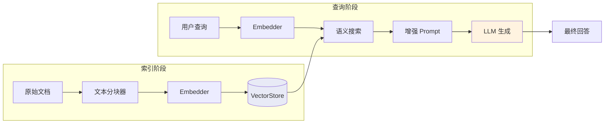
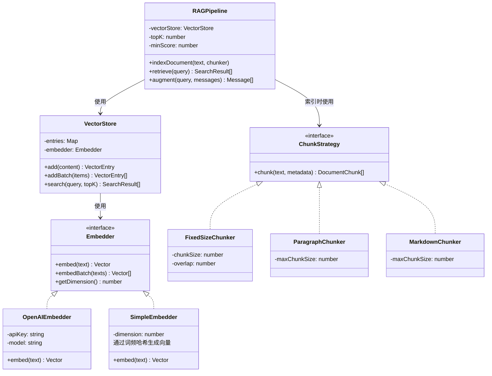
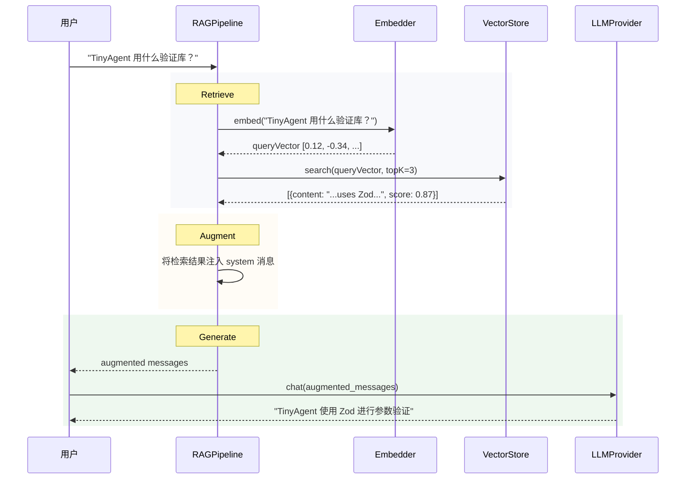
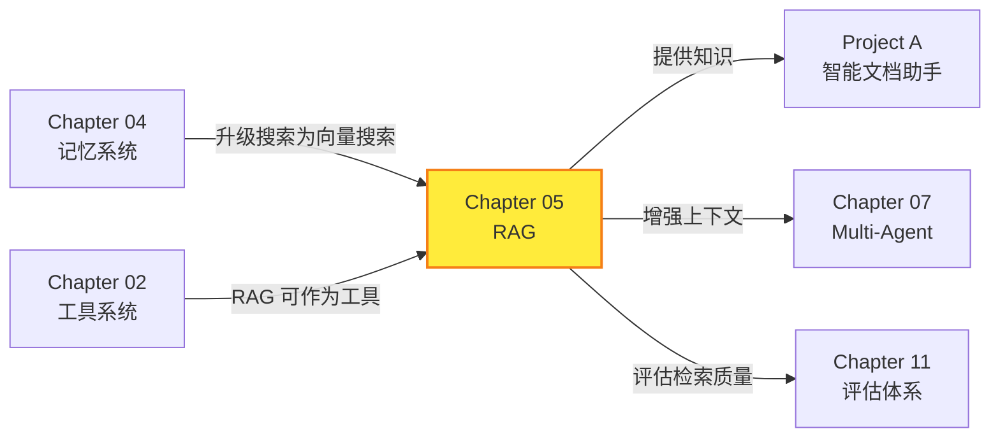

# Chapter 05: RAG 集成 -- 让 Agent 拥有知识库

> **目标**：用纯 TypeScript 实现向量运算、Embedding、向量存储和 RAG Pipeline，让 Agent 能基于外部知识库回答问题。

---

## 本章概览

| 你将学到 | 关键产出 |
|---------|---------|
| Embedding 的数学本质 | `vector-math.ts` 纯 TS 向量运算 |
| 余弦相似度与语义搜索 | `SimpleEmbedder` + `OpenAIEmbedder` |
| 文本分块策略 | 3 种 Chunker 实现 |
| 向量数据库的核心原理 | `VectorStore` 内存向量存储 |
| RAG Pipeline 架构 | `RAGPipeline` 检索增强生成 |

---

## 5.1 什么是 RAG？

### 5.1.1 问题背景

LLM 有两个根本性限制：

1. **知识截止**：训练数据有截止时间，不知道最新信息
2. **幻觉**：对不了解的问题，可能编造看似合理但错误的答案

```
用户: TinyAgent 框架的最新版本是什么？
LLM:  我不确定，但根据我的知识... (开始编造)
```

### 5.1.2 RAG 的解法

**RAG（Retrieval-Augmented Generation）** 在 2020 年由 Meta 的论文 [Retrieval-Augmented Generation for Knowledge-Intensive NLP Tasks](https://arxiv.org/abs/2005.11401) 提出。

核心思想：**先检索，再生成**。

```
用户:   TinyAgent 最新版本是什么？
检索 →  [从知识库中找到] "TinyAgent v1.0 支持 OpenAI 和 Anthropic"
增强 →  将检索结果注入 LLM 的上下文
生成 →  "TinyAgent 的最新版本是 v1.0"
```

### 5.1.3 RAG 的四个阶段

```
Index → Retrieve → Augment → Generate
 索引      检索        增强       生成
```

| 阶段 | 做什么 | 我们的实现 |
|------|--------|----------|
| Index | 将文档转为向量存储 | `VectorStore.addBatch()` |
| Retrieve | 语义搜索最相关的文档块 | `VectorStore.search()` |
| Augment | 将检索结果注入 prompt | `RAGPipeline.augment()` |
| Generate | LLM 基于增强上下文生成回答 | `Provider.chat()` |

### 5.1.4 官方参考

- RAG 论文：https://arxiv.org/abs/2005.11401
- OpenAI Embedding 指南：https://platform.openai.com/docs/guides/embeddings
- OpenAI Embedding API：https://platform.openai.com/docs/api-reference/embeddings

---

## 5.2 Embedding 的数学本质

### 5.2.1 什么是 Embedding？

**Embedding** 是将文本映射为高维空间中的一个向量（数组）。

```
"TypeScript"      → [0.12, -0.34, 0.56, ...]  (1536 维)
"JavaScript"      → [0.11, -0.33, 0.57, ...]  (很接近 TypeScript)
"How to cook"     → [-0.45, 0.22, -0.11, ...] (完全不同)
```

**语义相近的文本，向量在空间中距离相近**——这就是语义搜索的数学基础。

### 5.2.2 余弦相似度 -- 核心度量

余弦相似度衡量两个向量**方向**的相似程度，不受长度影响。

$$\text{cosine}(\vec{a}, \vec{b}) = \frac{\vec{a} \cdot \vec{b}}{||\vec{a}|| \times ||\vec{b}||}$$

| 值 | 含义 |
|----|------|
| 1 | 完全相同方向（极其相似） |
| 0 | 正交（完全无关） |
| -1 | 完全相反方向 |

**纯 TypeScript 实现**：

```typescript
export function cosineSimilarity(a: Vector, b: Vector): number {
  const dot = dotProduct(a, b);
  const magA = magnitude(a);
  const magB = magnitude(b);
  if (magA === 0 || magB === 0) return 0;
  return dot / (magA * magB);
}
```

### 5.2.3 为什么我们自己实现向量运算？

生产环境通常用 numpy（Python）或 hnswlib（C++）等库。我们手写的原因：

1. **理解原理**：亲手实现公式，理解 Embedding 搜索的本质
2. **零依赖**：纯 TypeScript，不需要 native addon
3. **足够用**：对于教学级别的向量数量（<1 万条），暴力搜索已经足够快

---

## 5.3 架构设计

### 5.3.1 RAG Pipeline 整体架构



### 5.3.2 组件关系图



### 5.3.3 一次 RAG 查询的时序图



---

## 5.4 实现步骤

### Step 1: 向量运算 -- `src/rag/vector-math.ts`

纯 TypeScript 实现 6 个核心运算：

| 函数 | 用途 |
|------|------|
| `dotProduct(a, b)` | 点积 -- 余弦相似度的基础 |
| `magnitude(a)` | 模长 -- 向量的"长度" |
| `cosineSimilarity(a, b)` | 余弦相似度 -- 语义搜索的核心度量 |
| `euclideanDistance(a, b)` | 欧氏距离 -- 另一种距离度量 |
| `normalize(a)` | L2 归一化 -- 预处理加速搜索 |
| `vectorMean(vectors)` | 向量均值 -- 聚合多个 embedding |

**优化技巧**：存储时将向量 L2 归一化后，`cosineSimilarity` 退化为 `dotProduct`（因为模长恒为 1），计算更快。

### Step 2: Embedding 提供者 -- `src/rag/embedder.ts`

#### OpenAIEmbedder（生产级）

调用 OpenAI `/embeddings` API，支持 batch 操作：

```typescript
const response = await fetch(`${this.baseUrl}/embeddings`, {
  method: 'POST',
  headers: { Authorization: `Bearer ${this.apiKey}` },
  body: JSON.stringify({ model: this.model, input: texts }),
});
```

#### SimpleEmbedder（教学级）

不需要 API，纯本地实现：

1. **分词**：文本拆为单词
2. **词频统计**：计算每个词的 TF（Term Frequency）
3. **Feature Hashing**：将稀疏词频向量通过多哈希函数降维到固定维度
4. **L2 归一化**：确保向量模长为 1

```typescript
// Feature Hashing 核心
for (const [term, freq] of termFreq) {
  const hashes = this.multiHash(term, 3);  // 3 个哈希位置
  for (const h of hashes) {
    const idx = Math.abs(h) % this.dimension;
    const sign = h >= 0 ? 1 : -1;          // 随机正负减少碰撞
    vector[idx] += sign * (freq / tokens.length);
  }
}
```

**为什么不用 TF-IDF？** TF-IDF 需要预先知道全部文档的 IDF（逆文档频率），不适合流式添加文档。Feature Hashing 是在线算法，可以随时添加新文档。

### Step 3: 文本分块器 -- `src/rag/chunker.ts`

为什么需要分块？
- Embedding 模型对短文本效果更好（<512 tokens 最佳）
- 检索时需要精确定位到段落，而非整篇文档
- 分块让每个 Embedding 聚焦于单一语义主题

| 分块器 | 适合场景 |
|-------|---------|
| `FixedSizeChunker` | 通用文本，按字符数固定切分 |
| `ParagraphChunker` | 段落结构清晰的文本 |
| `MarkdownChunker` | Markdown 文档，按标题分节 |

**重叠（Overlap）** 的作用：

```
块1: [AAAA|BBB]        没有重叠 → 跨块边界的信息丢失
块2:       [CCC|DDD]

块1: [AAAA|BBB]        有重叠 → 跨块信息在重叠区域保留
块2:     [BBB|CCC]
```

### Step 4: 向量存储 -- `src/rag/vector-store.ts`

内存向量数据库的核心是**暴力搜索**（Brute Force）：

```typescript
async search(query: string, topK = 5, minScore = 0): Promise<SearchResult[]> {
    const queryVector = normalize(await this.embedder.embed(query));

    const results: SearchResult[] = [];
    for (const entry of this.entries.values()) {
        const score = cosineSimilarity(queryVector, entry.vector);
        if (score >= minScore) results.push({ entry, score });
    }

    results.sort((a, b) => b.score - a.score);
    return results.slice(0, topK);
}
```

**生产级优化**：数据量大时（>10 万条），暴力搜索太慢。常用的近似最近邻（ANN）算法：
- **HNSW**（Hierarchical Navigable Small World）-- Pinecone、Qdrant 使用
- **IVF**（Inverted File Index）-- Faiss 使用
- **LSH**（Locality-Sensitive Hashing）-- 简单但精度较低

### Step 5: RAG Pipeline -- `src/rag/rag-pipeline.ts`

RAG Pipeline 是一个编排层，串联索引、检索和增强：

```typescript
async augment(query: string, messages: Message[]): Promise<Message[]> {
    // 1. 检索
    const results = await this.vectorStore.search(query, this.topK, this.minScore);
    if (results.length === 0) return messages;

    // 2. 格式化检索结果
    const contextText = this.contextTemplate(results);

    // 3. 注入 system 消息
    const sys = messages[0];
    sys.content = `${sys.content}\n\n${contextText}`;

    return messages;
}
```

---

## 5.5 测试验证

### 5.5.1 单元测试

本章编写了 69 个单元测试：

```bash
npx vitest run src/rag/__tests__/
```

| 测试文件 | 测试数 | 覆盖内容 |
|---------|--------|---------|
| `vector-math.test.ts` | 26 | 点积、模长、余弦相似度、欧氏距离、归一化、向量运算 |
| `embedder.test.ts` | 7 | SimpleEmbedder：维度、确定性、语义相似度、归一化 |
| `chunker.test.ts` | 13 | 3 种分块器：固定大小/段落/Markdown |
| `vector-store.test.ts` | 12 | VectorStore：CRUD + 语义搜索 + topK/minScore |
| `rag-pipeline.test.ts` | 11 | RAGPipeline：索引/检索/增强/自定义模板 |

### 5.5.2 集成测试

4 个集成测试（2 个 RAG + LLM 端到端，2 个 Embedding API 检测）：

| 测试 | 验证内容 |
|------|---------|
| 完整 RAG 流程 | 索引 → 检索 → 增强 → LLM 生成（SimpleEmbedder + 真实 LLM） |
| RAG 知识问答 | LLM 应从检索上下文中找到正确答案 |
| Embedding API 检测 | 自动检测端点是否支持 Embedding 模型 |
| 语义相似度 | 验证 OpenAI Embedding 的语义捕获能力 |

> **注意**：如果你的 API 端点不支持 Embedding 模型（如本教程使用的代理端点），Embedding API 测试会自动跳过并标记为 SKIP，不影响其他测试。

---

## 5.6 深入思考

### 5.6.1 SimpleEmbedder vs OpenAIEmbedder

| | SimpleEmbedder | OpenAIEmbedder |
|-|---------------|----------------|
| 精度 | 低（词频级别） | 高（语义级别） |
| 速度 | 极快（本地计算） | 慢（API 调用 ~200ms） |
| 成本 | 零 | $0.02 / 百万 tokens |
| 离线 | 是 | 否 |
| 适合 | 测试、原型、离线 | 生产级语义搜索 |

**最佳实践**：开发和测试用 SimpleEmbedder，生产环境用 OpenAIEmbedder（或其他模型如 Cohere、Voyage AI）。

### 5.6.2 分块大小的影响

| 块大小 | 优势 | 劣势 |
|-------|------|------|
| 小（100-300 chars）| 检索精确 | 可能丢失上下文 |
| 中（300-800 chars）| 平衡 | 通用选择 |
| 大（800-2000 chars）| 上下文完整 | 检索噪音多 |

**经验法则**：对于一般知识库，300-500 字符 + 50 字符重叠是好的起点。

### 5.6.3 RAG 的局限性

| 问题 | 说明 | 缓解方案 |
|------|------|---------|
| **检索失败** | 查询和文档用不同的词表述 | 查询重写（Query Rewriting） |
| **上下文窗口** | 检索结果太多塞不下 | 重排序（Reranking） |
| **知识冲突** | 检索到的信息与 LLM 知识矛盾 | 明确的 prompt："仅基于提供的上下文" |
| **多跳推理** | 答案需要跨多个文档块 | 迭代检索（Chapter 03 的 ReAct 循环） |

### 5.6.4 从 Chapter 04 的关键词搜索到向量搜索

| | Chapter 04 关键词搜索 | Chapter 05 向量搜索 |
|-|---------------------|-------------------|
| "推荐编程语言" → 找 "喜欢 TypeScript" | ❌ 无重叠关键词 | ✅ 语义相关 |
| "JS 和 TS 有什么区别" → 找 "JavaScript vs TypeScript" | ❌ 缩写不匹配 | ✅ 语义理解 |
| 计算复杂度 | O(n × k) k=关键词数 | O(n × d) d=向量维度 |
| 存储 | 纯文本 | 文本 + 向量 |

---

## 5.7 与前后章节的关系



---

## 5.8 关键文件清单

| 文件 | 说明 | 行数 |
|------|------|------|
| `src/rag/vector-math.ts` | 纯 TS 向量运算（8 个函数） | ~110 |
| `src/rag/embedder.ts` | OpenAIEmbedder + SimpleEmbedder | ~170 |
| `src/rag/chunker.ts` | 3 种文本分块器 | ~180 |
| `src/rag/vector-store.ts` | 内存向量存储 + 语义搜索 | ~130 |
| `src/rag/rag-pipeline.ts` | RAG Pipeline 编排层 | ~130 |
| `src/rag/index.ts` | 模块导出 | ~30 |
| `src/rag/__tests__/vector-math.test.ts` | 向量运算测试 | ~110 |
| `src/rag/__tests__/embedder.test.ts` | Embedder 测试 | ~55 |
| `src/rag/__tests__/chunker.test.ts` | 分块器测试 | ~110 |
| `src/rag/__tests__/vector-store.test.ts` | VectorStore 测试 | ~110 |
| `src/rag/__tests__/rag-pipeline.test.ts` | RAG Pipeline 测试 | ~120 |
| `src/rag/__tests__/integration.test.ts` | 集成测试 | ~110 |
| `examples/05-rag-basics.ts` | RAG 演示 | ~100 |

---

## 5.9 本章小结

本章用纯 TypeScript 实现了完整的 RAG 系统：

1. **向量数学**：手写 `dotProduct`、`cosineSimilarity`、`normalize` 等 8 个核心运算，深入理解 Embedding 搜索的数学基础
2. **双 Embedder**：`SimpleEmbedder`（本地词频哈希）用于测试和理解原理，`OpenAIEmbedder`（调用 API）用于生产级语义搜索
3. **文本分块**：3 种策略（固定大小 / 段落 / Markdown），支持重叠保留跨块信息
4. **向量存储**：纯内存实现，支持归一化加速、topK 过滤、minScore 阈值
5. **RAG Pipeline**：串联索引→检索→增强的完整流程，可直接接入 Agent

**关键收获**：
- Embedding 的本质是将语义映射到向量空间，余弦相似度衡量语义距离
- RAG 让 LLM 突破知识截止限制，能回答基于私有知识库的问题
- 分块策略对检索质量影响巨大，需要根据文档类型调优

**下一章预告**：Chapter 06 将实现**流式输出**——让 Agent 的回复像真人打字一样逐字显示，大幅提升用户体验。
