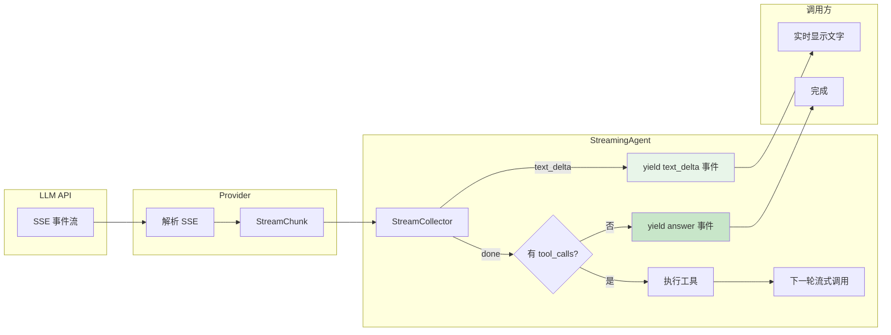
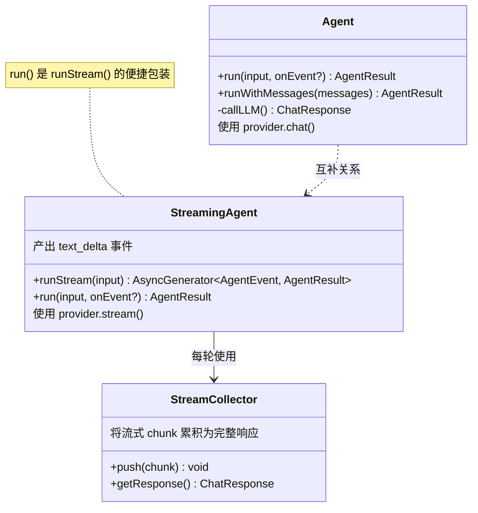
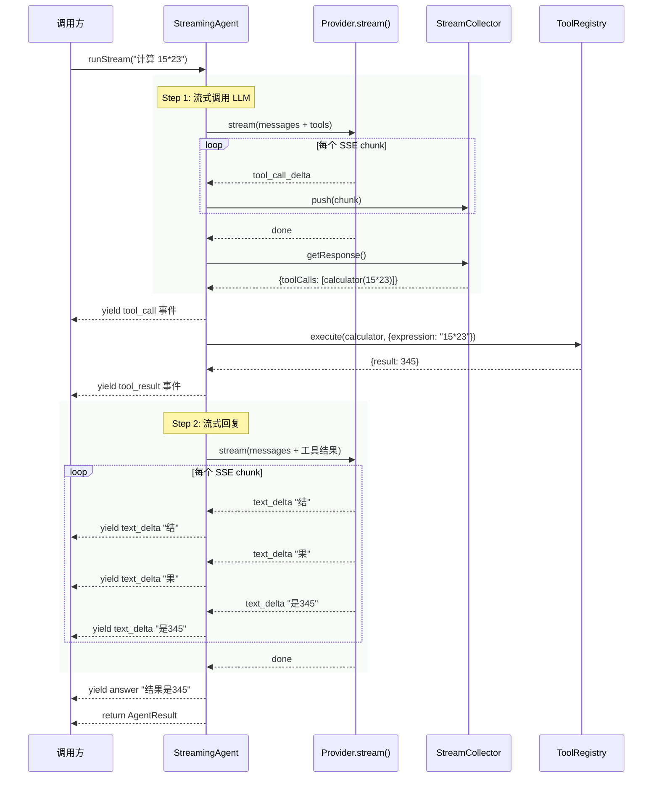

# Chapter 06: 流式输出 -- 让 Agent 实时"说话"

> **目标**：实现流式输出的 Agent，让回复像真人打字一样逐字显示，同时支持流式工具调用的完整 ReAct 循环。

---

## 本章概览

| 你将学到 | 关键产出 |
|---------|---------|
| SSE 流式协议原理 | `StreamCollector` 流式收集器 |
| AsyncGenerator 模式 | `StreamingAgent` 流式 Agent |
| 流式工具调用的特殊处理 | `collectStream` / `streamToText` 工具函数 |
| TTFT（首字时延）优化 | 完整单元测试 + 集成测试 |

---

## 6.1 为什么需要流式输出？

### 6.1.1 用户体验问题

非流式 Agent 的交互模式：

```
用户: 解释量子计算
Agent: [等待 3-5 秒...] [一次性输出 500 字]
```

流式 Agent 的交互模式：

```
用户: 解释量子计算
Agent: 量|子|计|算|是|利|用|量|子|力|学|原|理|... (逐字显示)
```

**关键指标 TTFT（Time To First Token）**：从发送请求到收到第一个字符的时间。
- 非流式：TTFT = 完整生成时间（3-5 秒）
- 流式：TTFT ≈ 200-500ms

### 6.1.2 技术基础

流式输出基于 **SSE（Server-Sent Events）** 协议，Chapter 01 的 OpenAI Provider 已经实现了底层解析。本章要做的是在 Agent 层面利用这个能力。

---

## 6.2 架构设计

### 6.2.1 流式 Agent 数据流



**关键设计**：
- `text_delta` 事件实时产出，不等整个响应结束
- 工具调用需要**先收集完整**（因为 arguments 是分块到达的），再一次性执行
- 使用 `AsyncGenerator` 让调用方通过 `for await` 消费事件

### 6.2.2 StreamingAgent vs Agent 对比



### 6.2.3 一次流式 ReAct 循环



---

## 6.3 核心实现

### 6.3.1 StreamCollector -- 流式收集器

`StreamCollector` 的职责：将碎片化的 `StreamChunk` 累积为完整的 `ChatResponse`。

```typescript
export class StreamCollector {
  private content = '';
  private toolCalls: Map<number, { id, name, arguments }>;

  push(chunk: StreamChunk): void {
    switch (chunk.type) {
      case 'text_delta':
        this.content += chunk.content ?? '';
        break;
      case 'tool_call_delta':
        // 覆盖式更新（Provider 已累积）
        existing.name = delta.function.name;
        existing.arguments = delta.function.arguments;
        break;
      case 'usage':
        this.usage = chunk.usage;
        break;
    }
  }

  getResponse(): ChatResponse { /* 组装完整响应 */ }
}
```

**关键细节**：工具调用的 `name` 和 `arguments` 使用**覆盖**而非追加，因为 Provider 层已经做了累积。这避免了双重累积导致的 name 过长错误。

### 6.3.2 StreamingAgent -- 流式 Agent

核心方法 `runStream()` 使用 `AsyncGenerator`：

```typescript
async *runStream(input: string): AsyncGenerator<StreamingAgentEvent, AgentResult> {
    while (step < this.maxSteps) {
      step++;

      // 1. 流式调用 LLM
      const stream = this.provider.stream(request);

      // 2. 逐 chunk 处理
      for await (const chunk of stream) {
        collector.push(chunk);
        if (chunk.type === 'text_delta' && chunk.content) {
          yield { type: 'text_delta', step, content: chunk.content };
        }
      }

      // 3. 判断是否需要工具调用
      const response = collector.getResponse();
      if (!response.toolCalls?.length) {
        yield { type: 'answer', step, content };
        return agentResult;
      }

      // 4. 执行工具
      for (const toolCall of response.toolCalls) {
        yield { type: 'tool_call', ... };
        const result = await this.tools.execute(toolCall);
        yield { type: 'tool_result', ... };
      }
    }
}
```

### 6.3.3 双接口设计

`StreamingAgent` 提供两种调用方式：

```typescript
// 方式 1: AsyncGenerator -- 最大灵活性
const gen = agent.runStream(input);
for await (const event of gen) {
  if (event.type === 'text_delta') process.stdout.write(event.content);
}

// 方式 2: 回调模式 -- 与 Agent.run() 接口一致
const result = await agent.run(input, (event) => {
  if (event.type === 'text_delta') process.stdout.write(event.content);
});
```

`run()` 内部就是消费 `runStream()` 的 Generator。

---

## 6.4 `text_delta` 事件设计

在 `AgentEvent` 联合类型中新增了 `text_delta`：

```typescript
export type AgentEvent =
  | { type: 'text_delta'; step: number; content: string }   // ← 新增
  | { type: 'thinking'; step: number; content: string | null }
  | { type: 'tool_call'; ... }
  | { type: 'tool_result'; ... }
  | { type: 'answer'; step: number; content: string }
  | { type: 'error'; ... }
  | { type: 'max_steps_reached'; ... };
```

**设计决策**：将 `text_delta` 加入统一的 `AgentEvent`（而非独立类型），这样：
- `StreamingAgent` 和 `Agent` 共享同一个事件类型
- 可观测性系统（Chapter 10）不需要区分两种事件体系
- `Agent` 只是不会产出 `text_delta`，消费方可以安全忽略

---

## 6.5 测试验证

### 6.5.1 单元测试

本章编写了 14 个单元测试：

```bash
npx vitest run src/streaming/__tests__/
```

| 测试文件 | 测试数 | 覆盖内容 |
|---------|--------|---------|
| `stream-utils.test.ts` | 8 | StreamCollector 累积 + collectStream + streamToText |
| `streaming-agent.test.ts` | 6 | 纯文本流式 + 工具调用 + maxSteps + 错误处理 + Token 累计 |

### 6.5.2 集成测试

3 个集成测试（真实 API）：

| 测试 | 验证内容 |
|------|---------|
| 纯文本逐字输出 | text_delta 拼接 = 最终 content |
| 流式工具调用循环 | 完整 ReAct：流式收集工具调用 → 执行 → 流式回复 |
| AsyncGenerator 模式 | runStream() 正确产出事件和返回结果 |

### 6.5.3 修复的 Bug

在集成测试中发现并修复了一个关键 Bug：

**问题**：`StreamCollector` 对工具调用的 `name` 字段使用 `+=` 追加，但 Provider 层产出的 `tool_call_delta` 已经是累积值（非增量），导致 name 被重复追加，超过 OpenAI 64 字符限制。

**修复**：将 `existing.name += delta.function.name` 改为 `existing.name = delta.function.name`（覆盖）。

---

## 6.6 深入思考

### 6.6.1 流式 vs 非流式的权衡

| | 流式 | 非流式 |
|-|------|-------|
| TTFT | ~200ms | 2-5s |
| 用户体验 | 极好（打字感） | 一般（等待感） |
| 代码复杂度 | 高（AsyncGenerator, 状态管理） | 低 |
| 错误处理 | 复杂（中途断流） | 简单 |
| 适合场景 | 用户交互界面 | 后台批处理 |

**建议**：用户可见的场景用 `StreamingAgent`，后台任务用 `Agent`。

### 6.6.2 流式工具调用的挑战

工具调用在流式中更复杂，因为：
1. `tool_calls` 的 `arguments` 是 JSON 字符串，分多个 chunk 到达
2. 必须等 `arguments` 完整后才能解析和执行
3. 一轮可能有多个并行 tool_calls

解决方案：`StreamCollector` 先收集完整响应，再判断是否有工具调用。这意味着工具调用阶段**不是**逐字流式的——而是等收集完 → 执行工具 → 再流式输出最终回复。

### 6.6.3 AsyncGenerator 的优势

```typescript
async *runStream(input): AsyncGenerator<Event, Result>
```

AsyncGenerator 的返回类型 `AsyncGenerator<YieldType, ReturnType>` 完美匹配了 Agent 的需求：
- **YieldType = AgentEvent**：中间产出的每个事件
- **ReturnType = AgentResult**：最终返回的完整结果

调用方可以选择：
- `for await` 遍历所有事件
- `.next()` 手动控制步进
- 随时 `.return()` 提前终止

---

## 6.7 与前后章节的关系

```mermaid
graph LR
    Ch01[Chapter 01<br/>Provider.stream()] -->|提供底层流| Ch06[Chapter 06<br/>StreamingAgent]
    Ch03[Chapter 03<br/>Agent / ReAct] -->|扩展为流式| Ch06
    Ch06 -->|流式事件| Ch10[Chapter 10<br/>可观测性]
    Ch06 -->|实时输出| PA[Project A<br/>智能文档助手]
    Ch06 -->|UI 体验| PC[Project C<br/>客服智能体]

    style Ch06 fill:#ffeb3b,stroke:#f57f17,stroke-width:2px
```

---

## 6.8 关键文件清单

| 文件 | 说明 | 行数 |
|------|------|------|
| `src/streaming/stream-utils.ts` | StreamCollector + collectStream + streamToText | ~120 |
| `src/streaming/streaming-agent.ts` | 流式 Agent（AsyncGenerator + 回调） | ~220 |
| `src/streaming/index.ts` | 模块导出 | ~10 |
| `src/streaming/__tests__/stream-utils.test.ts` | 流式工具函数测试 | ~120 |
| `src/streaming/__tests__/streaming-agent.test.ts` | 流式 Agent 测试 | ~170 |
| `src/streaming/__tests__/integration.test.ts` | 集成测试 | ~90 |
| `examples/06-streaming-agent.ts` | 流式演示 | ~110 |

---

## 6.9 本章小结

本章实现了流式输出的 Agent：

1. **StreamCollector**：将碎片化的 `StreamChunk` 累积为完整 `ChatResponse`，正确处理文本和工具调用的累积
2. **StreamingAgent**：基于 `AsyncGenerator` 的流式 ReAct 循环，实时产出 `text_delta` 事件
3. **双接口设计**：`runStream()` 提供最大灵活性，`run()` 提供与 Agent 一致的回调接口
4. **统一事件体系**：`text_delta` 加入 `AgentEvent` 联合类型，Agent 和 StreamingAgent 共享同一套事件

**关键收获**：
- 流式输出的核心是 TTFT 优化，极大提升用户体验
- 工具调用在流式中需要"先收集完整再执行"的策略
- AsyncGenerator 是 TypeScript 中实现流式 Agent 的最佳模式

**下一章预告**：完成前 6 章后，我们已经有了完整的 Agent 基础能力。接下来 Project A（智能文档助手）将把这些能力组合成一个实战项目。
