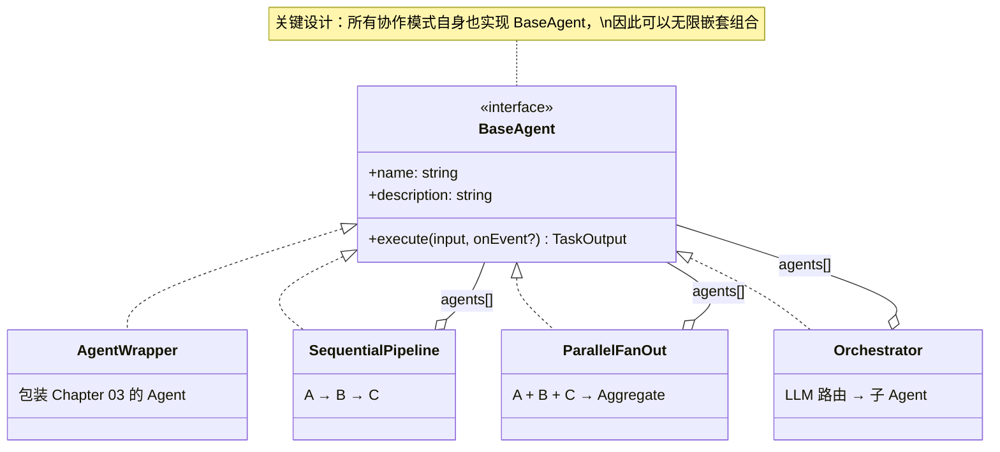
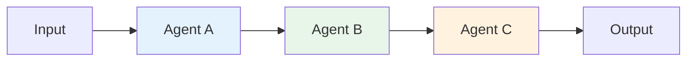
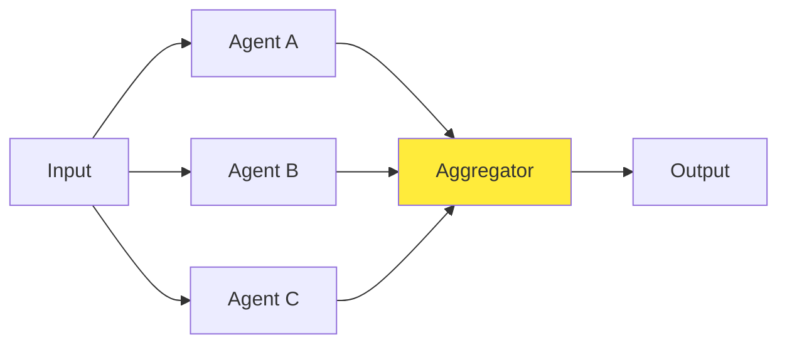
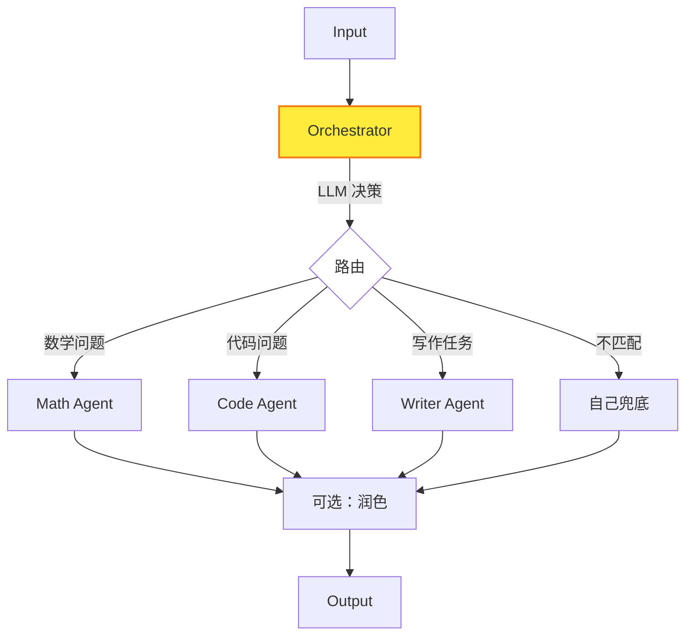
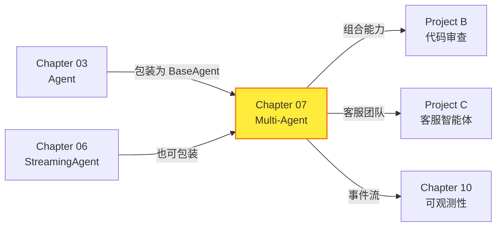

# Chapter 07: Multi-Agent 系统 -- 让 Agent 学会协作

> **目标**：实现三种 Multi-Agent 协作模式，让多个专业 Agent 协同完成复杂任务。

---

## 本章概览

| 你将学到 | 关键产出 |
|---------|---------|
| Multi-Agent 架构模式 | `BaseAgent` 统一接口 |
| 串行流水线 | `SequentialPipeline` |
| 并行扇出 | `ParallelFanOut` |
| LLM 路由 | `Orchestrator` |
| 组合模式 | Agent 可嵌套组合 |

---

## 7.1 为什么需要 Multi-Agent？

### 7.1.1 单 Agent 的局限

单 Agent 模式（Chapter 03）面对复杂任务时存在瓶颈：

- **Prompt 膨胀**：一个 Agent 要承担多个角色，system prompt 越来越长
- **能力冲突**：让同一个 Agent 既做数学计算又写诗歌，效果都变差
- **无法并行**：顺序执行所有步骤，无法利用并发加速
- **可维护性差**：所有逻辑耦合在一个 Agent 里

### 7.1.2 Multi-Agent 的优势

```
单 Agent:    [超级全能 Agent] → 什么都能做，什么都做不精

Multi-Agent: [路由器] → [数学专家] → 精准计算
                     → [写作专家] → 精美文章
                     → [代码专家] → 高质量代码
```

**专业化分工** + **灵活组合** = 更强的整体能力。

> 📖 **参考**：[Anthropic Multi-Agent Systems](https://docs.anthropic.com/en/docs/build-with-claude/agentic-systems#multi-agent-systems)

---

## 7.2 架构设计

### 7.2.1 核心接口：BaseAgent

所有协作模式的基础是一个**统一接口**：



**设计哲学**：`SequentialPipeline`、`ParallelFanOut`、`Orchestrator` 自身也实现 `BaseAgent` 接口。这意味着它们可以像积木一样嵌套：

```typescript
// Pipeline 中嵌套 Parallel
const pipeline = new SequentialPipeline({
  agents: [
    researcher,
    new ParallelFanOut({ agents: [optimist, pessimist] }),
    summarizer,
  ],
});
```

### 7.2.2 数据流模型

```typescript
interface TaskInput {
  content: string;              // 文本输入
  metadata?: Record<string, unknown>; // 结构化数据传递
}

interface TaskOutput {
  content: string;              // 文本输出
  agentName: string;            // 产出者
  result?: AgentResult;         // 底层 Agent 详情
  metadata?: Record<string, unknown>; // 向下游传递
}
```

---

## 7.3 三种协作模式

### 7.3.1 SequentialPipeline -- 串行流水线



**原理**：前一个 Agent 的输出作为后一个的输入。

**适用场景**：
- 内容生产：研究 → 撰写 → 审校
- 数据处理：提取 → 转换 → 验证
- 代码流程：编写 → 测试 → 审查

```typescript
const pipeline = new SequentialPipeline({
  name: 'content-pipeline',
  agents: [researcher, writer, reviewer],
});

const result = await pipeline.execute({ content: '写一篇 TypeScript 教程' });
```

### 7.3.2 ParallelFanOut -- 并行扇出



**原理**：同一输入分发给多个 Agent 并行处理，再用策略合并结果。

**聚合策略**：

| 策略 | 行为 | 适用场景 |
|------|------|---------|
| `concatenate` | 拼接所有结果 | 多视角分析 |
| `first_success` | 取第一个成功的 | 冗余/容错 |
| `longest` | 取最长的 | 选择最详细的回答 |
| 自定义函数 | 完全自定义 | 投票、评分等 |

```typescript
const parallel = new ParallelFanOut({
  agents: [optimist, pessimist, realist],
  strategy: 'concatenate',
  continueOnError: true,
});
```

### 7.3.3 Orchestrator -- 智能路由



**原理**：用 LLM 分析用户意图，自动选择最合适的子 Agent。

**路由流程**：
1. 构造 routing prompt，列出所有子 Agent 的 name + description
2. LLM 输出 JSON 决策：`{agentName, reason, refinedInput?}`
3. 调用选中的子 Agent
4. 可选：用 LLM 润色最终输出

**降级策略**：
- JSON 解析失败 → 正则提取
- Agent 名不存在 → 自己兜底回答
- LLM 完全不可用 → 默认选第一个 Agent

```typescript
const orchestrator = new Orchestrator({
  provider, model,
  agents: [mathAgent, codeAgent, writerAgent],
  refineOutput: true,
});
```

---

## 7.4 观测事件

Multi-Agent 系统新增了专用事件类型：

```typescript
type MultiAgentEvent =
  | { type: 'task_assigned'; agentName: string; input: string }
  | { type: 'task_completed'; agentName: string; output: string; durationMs: number }
  | { type: 'task_failed'; agentName: string; error: string }
  | { type: 'orchestrator_thinking'; content: string }
  | { type: 'pipeline_step'; step: number; agentName: string }
  | { type: 'parallel_start'; agents: string[] }
  | { type: 'parallel_done'; results: Array<{ agentName: string; success: boolean }> };
```

通过 `onEvent` 回调，可以实时追踪整个协作过程。

---

## 7.5 测试验证

### 单元测试（28 个）

| 测试文件 | 测试数 | 覆盖内容 |
|---------|--------|---------|
| `agent-wrapper.test.ts` | 4 | 包装执行、事件产出、错误处理、属性暴露 |
| `sequential.test.ts` | 7 | 链式传递、单步、三步、事件、metadata、空校验、异常中断 |
| `parallel.test.ts` | 10 | 4 种聚合策略、错误容忍/严格模式、全失败、事件、metadata |
| `orchestrator.test.ts` | 7 | 正确路由、兜底回答、markdown JSON、事件、refinedInput、LLM 故障降级、结果润色 |

---

## 7.6 深入思考

### 7.6.1 嵌套组合的威力

由于所有模式都实现 `BaseAgent`，可以构建复杂的协作拓扑：

```typescript
// Orchestrator → Pipeline → ParallelFanOut → Agent
const system = new Orchestrator({
  agents: [
    new SequentialPipeline({
      agents: [
        researcher,
        new ParallelFanOut({ agents: [reviewer1, reviewer2] }),
        editor,
      ],
    }),
    mathExpert,
    codeExpert,
  ],
});
```

### 7.6.2 Orchestrator vs 硬编码路由

| | Orchestrator（LLM 路由） | 硬编码路由 |
|-|------------------------|-----------|
| 灵活性 | 高（自然语言理解意图） | 低（关键词匹配） |
| 成本 | 每次路由消耗 1 次 LLM 调用 | 0 |
| 准确性 | 依赖 LLM 质量 | 依赖规则完备性 |
| 适用场景 | 开放域任务 | 明确分类的任务 |

**建议**：流量大、分类明确时用硬编码路由；探索性、开放域任务用 Orchestrator。

### 7.6.3 并行执行的注意事项

- **API 限速**：并行调用多个 Agent 时注意 LLM API 的 rate limit
- **错误传播**：`continueOnError: true` 适合非关键性任务；关键任务用 `false`
- **结果一致性**：并行执行没有顺序保证，聚合策略要考虑这一点

---

## 7.7 与前后章节的关系



---

## 7.8 关键文件清单

| 文件 | 说明 |
|------|------|
| `src/multi-agent/base-agent.ts` | BaseAgent 接口 + TaskInput/TaskOutput + 事件类型 |
| `src/multi-agent/agent-wrapper.ts` | 将 Agent 包装为 BaseAgent |
| `src/multi-agent/sequential.ts` | 串行流水线 |
| `src/multi-agent/parallel.ts` | 并行扇出 + 4 种聚合策略 |
| `src/multi-agent/orchestrator.ts` | LLM 智能路由 + 兜底 + 润色 |
| `src/multi-agent/index.ts` | 模块导出 |
| `src/multi-agent/__tests__/*.test.ts` | 28 个单元测试 |
| `examples/07-multi-agent.ts` | 三种模式演示 |

---

## 7.9 本章小结

本章实现了三种 Multi-Agent 协作模式：

1. **SequentialPipeline** -- 串行流水线，前一个的输出作为后一个的输入
2. **ParallelFanOut** -- 并行扇出，同一任务分发给多个 Agent 再聚合
3. **Orchestrator** -- LLM 智能路由，自动选择最合适的子 Agent

**关键设计**：
- **统一接口**：所有模式实现 `BaseAgent`，可无限嵌套组合
- **事件驱动**：`MultiAgentEvent` 让整个协作过程可观测
- **容错降级**：Orchestrator 有三级降级策略，ParallelFanOut 支持 `continueOnError`

**下一章预告**：Chapter 08 将实现 MCP（Model Context Protocol）支持，让 Agent 能够通过标准协议连接外部工具和数据源。
