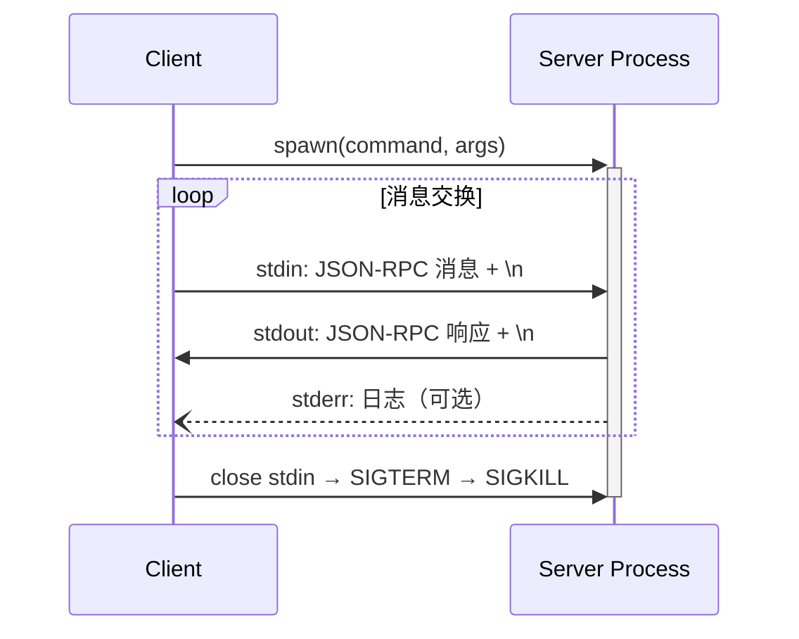
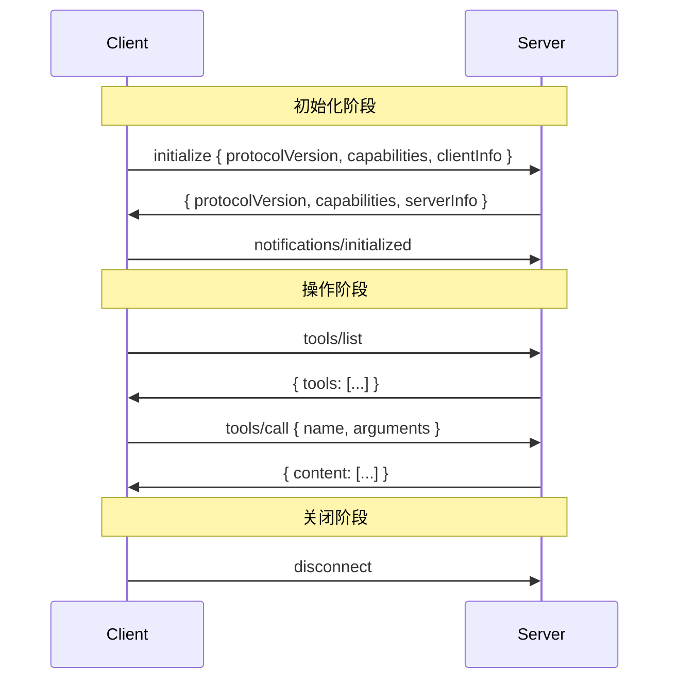
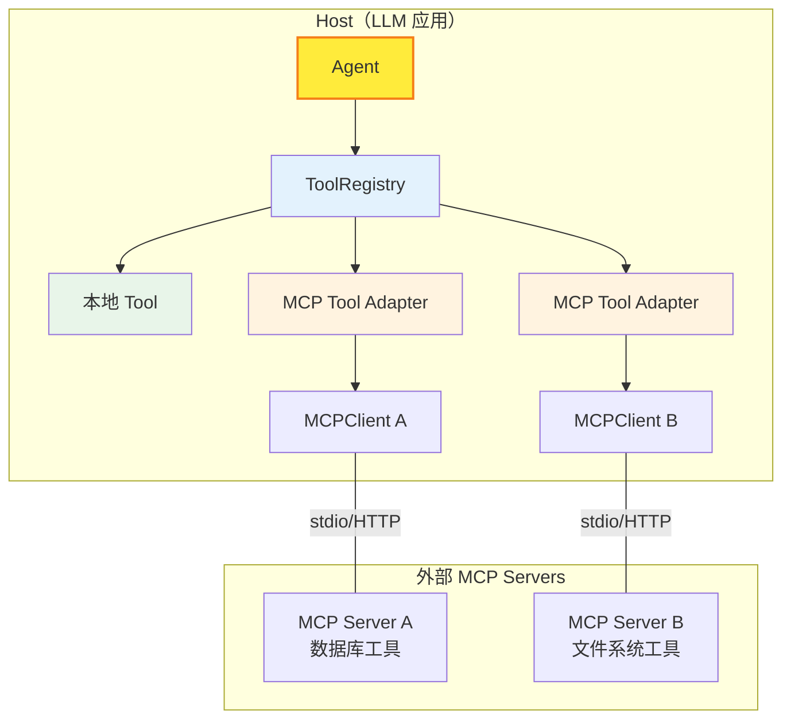
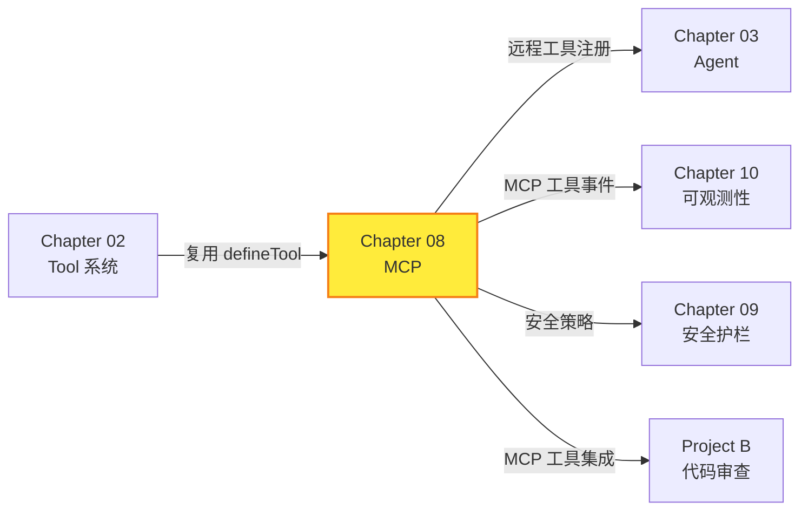

# Chapter 08: MCP 协议支持 -- 让 Agent 连接万物

> **目标**：实现 MCP（Model Context Protocol）的 Client 和 Server，让 Agent 能够通过标准协议连接外部工具和数据源。

---

## 本章概览

| 你将学到 | 关键产出 |
|---------|---------|
| MCP 协议原理 | JSON-RPC 消息层 |
| 传输层抽象 | `StdioTransport` + `InMemoryTransport` |
| MCP Client | 连接、发现、调用远程工具 |
| MCP Server | 暴露本地工具为 MCP 服务 |
| 工具桥接 | `adaptMCPTool` + `discoverMCPTools` |
| JSON Schema ↔ Zod | 双向转换 |

---

## 8.1 什么是 MCP？

### 8.1.1 问题背景

Agent 需要访问外部工具、数据库、API。但目前每个 LLM 框架都有自己的工具定义格式：

```
LangChain → @tool 装饰器 + 自定义 Schema
AutoGen → FunctionTool + JSON Schema
Semantic Kernel → KernelFunction
TinyAgent → defineTool + Zod
```

**MCP（Model Context Protocol）** 由 Anthropic 提出，定义了一个**标准化协议**，让 LLM 应用与外部工具/数据源之间有统一的通信方式。

> 📖 **官方规范**：[MCP Specification 2025-06-18](https://modelcontextprotocol.io/specification/2025-06-18)
> 📖 **TypeScript SDK**：[modelcontextprotocol/typescript-sdk](https://github.com/modelcontextprotocol/typescript-sdk)

### 8.1.2 MCP 的角色

```
┌──────────────────────────────────────────┐
│               Host（LLM 应用）             │
│                                          │
│   ┌──────────┐     ┌──────────┐          │
│   │ MCP      │     │ MCP      │          │
│   │ Client A │     │ Client B │          │
│   └────┬─────┘     └────┬─────┘          │
│        │                │                │
└────────┼────────────────┼────────────────┘
         │                │
    ┌────┴─────┐     ┌────┴─────┐
    │ MCP      │     │ MCP      │
    │ Server A │     │ Server B │
    │ (数据库)  │     │ (文件系统) │
    └──────────┘     └──────────┘
```

| 角色 | 说明 | 在我们框架中 |
|------|------|-------------|
| **Host** | LLM 应用，管理多个 Client | Agent / 应用层 |
| **Client** | 连接到一个 Server 的连接器 | `MCPClient` |
| **Server** | 提供工具、资源、提示词的服务 | `MCPServer` |

### 8.1.3 MCP 的三大能力

| 能力 | 说明 | 协议方法 |
|------|------|---------|
| **Tools** | Server 暴露可调用的函数 | `tools/list`, `tools/call` |
| **Resources** | Server 暴露可读的数据 | `resources/list`, `resources/read` |
| **Prompts** | Server 暴露提示词模板 | `prompts/list`, `prompts/get` |

本章实现 **Tools** 和 **Resources** 两大核心能力。

---

## 8.2 协议基础：JSON-RPC 2.0

MCP 使用 **JSON-RPC 2.0** 作为消息格式。

> 📖 **JSON-RPC 规范**：[jsonrpc.org/specification](https://www.jsonrpc.org/specification)

### 8.2.1 三种消息类型

```typescript
// 请求（期望响应）
{ jsonrpc: "2.0", id: 1, method: "tools/list", params: {} }

// 通知（不期望响应）
{ jsonrpc: "2.0", method: "notifications/initialized" }

// 响应
{ jsonrpc: "2.0", id: 1, result: { tools: [...] } }
// 或错误响应
{ jsonrpc: "2.0", id: 1, error: { code: -32601, message: "Method not found" } }
```

### 8.2.2 我们的实现

```typescript
// json-rpc.ts -- 核心工具函数
export function createRequest(method: string, params?: Record<string, unknown>): JsonRpcRequest;
export function createNotification(method: string): JsonRpcNotification;
export function createResponse(id: JsonRpcId, result: unknown): JsonRpcResponse;
export function createErrorResponse(id: JsonRpcId, code: number, message: string): JsonRpcResponse;
```

**设计决策**：
- 使用自增 ID 而非 UUID（简单够用）
- 每条消息独立序列化为一行 JSON（stdio 传输的要求）
- 标准错误码复用 JSON-RPC 2.0 定义

---

## 8.3 传输层

### 8.3.1 两种传输方式

MCP 规范定义了两种标准传输：

| 传输 | 原理 | 适用场景 |
|------|------|---------|
| **stdio** | Client 启动 Server 作为子进程，通过 stdin/stdout 通信 | 本地工具、IDE 集成 |
| **Streamable HTTP** | HTTP POST + SSE 流 | 远程服务、多 Client 连接 |

> 📖 **传输规范**：[MCP Transports](https://modelcontextprotocol.io/specification/2025-06-18/basic/transports)

### 8.3.2 Transport 接口

```typescript
interface Transport extends EventEmitter {
  send(message: JsonRpcMessage): void;
  close(): void;
  on(event: 'message', listener: (msg: JsonRpcMessage) => void): this;
  on(event: 'error', listener: (err: Error) => void): this;
  on(event: 'close', listener: () => void): this;
}
```

所有传输方式都实现同一接口。Client 和 Server 只与 `Transport` 接口交互，不关心底层通信方式。

### 8.3.3 StdioTransport



关键实现细节：
- 使用 `readline` 按行读取 stdout（每行一条 JSON-RPC 消息）
- stderr 用于日志，不参与协议通信
- 关闭时按照 close stdin → SIGTERM → SIGKILL 的顺序优雅退出

### 8.3.4 InMemoryTransport

用于测试的内存传输，成对创建：

```typescript
const [clientTransport, serverTransport] = InMemoryTransport.createPair();
// clientTransport.send() → serverTransport 的 'message' 事件
// serverTransport.send() → clientTransport 的 'message' 事件
```

使用 `queueMicrotask` 模拟异步传输，确保行为与真实传输一致。

---

## 8.4 MCP Client

### 8.4.1 生命周期



> 📖 **生命周期规范**：[MCP Lifecycle](https://modelcontextprotocol.io/specification/2025-06-18/basic/lifecycle)

### 8.4.2 核心 API

```typescript
const client = new MCPClient(transport, { clientName: 'MyApp', clientVersion: '1.0.0' });

// 连接并握手
const initResult = await client.connect();
console.log(initResult.serverInfo);  // { name: "Server", version: "1.0" }

// 工具操作
const tools = await client.listTools();
const result = await client.callTool('calculator', { a: 6, b: 7, op: '*' });

// 资源操作
const resources = await client.listResources();
const content = await client.readResource('file:///readme.txt');

// 断开
client.disconnect();
```

### 8.4.3 请求/响应匹配

Client 内部维护一个 `pendingRequests` Map，用 JSON-RPC 的 `id` 字段做请求/响应匹配：

```
发送 request { id: 1, method: "tools/list" }
       → pendingRequests.set(1, { resolve, reject, timer })

收到 response { id: 1, result: { tools: [...] } }
       → pendingRequests.get(1).resolve(result)
       → pendingRequests.delete(1)
```

每个请求都有超时保护，避免 Server 无响应导致客户端卡死。

---

## 8.5 MCP Server

### 8.5.1 设计

MCP Server 是**纯协议层**，只做消息路由和协议处理，不关心传输方式。

```typescript
const server = new MCPServer({ name: 'MyServer', version: '1.0.0' });

// 复用 Chapter 02 的 defineTool
server.addTool(calculatorTool);
server.addTool(greetTool);

// 注册资源
server.addResource({
  uri: 'file:///readme.txt',
  name: 'readme.txt',
  read: async () => 'Hello from MCP!',
});

// 连接传输层
server.connect(transport);
```

### 8.5.2 消息路由

```
收到 JSON-RPC 消息
  ├── 是 Notification？→ handleNotification()
  │     └── "notifications/initialized" → 标记初始化完成
  └── 是 Request？→ routeRequest()
        ├── "initialize"    → 返回能力协商结果
        ├── "tools/list"    → 返回工具列表
        ├── "tools/call"    → Zod 校验 → 执行 → 返回结果
        ├── "resources/list" → 返回资源列表
        ├── "resources/read" → 读取资源内容
        ├── "ping"          → 返回 {}
        └── 其他            → METHOD_NOT_FOUND 错误
```

### 8.5.3 与 Chapter 02 工具系统的复用

MCP Server 直接复用 `Tool` 和 `toolToDefinition`：

```
defineTool() → Tool 对象 → server.addTool(tool)
                              ↓
                        tools/list 请求时：
                          toolToDefinition(tool) → MCPToolDefinition
                              ↓
                        tools/call 请求时：
                          tool.parameters.safeParse() → tool.execute()
```

**同一个 `Tool` 对象，既可以注册到 `ToolRegistry`（本地 Agent 使用），也可以注册到 `MCPServer`（远程 Client 使用）。**

---

## 8.6 工具桥接 -- Agent 无缝使用远程工具

### 8.6.1 核心挑战

```
Agent → ToolRegistry → Tool { name, parameters: ZodType, execute }
                                       ↑
MCP Server 提供的是 MCPToolDefinition { name, inputSchema: JSON Schema }
```

需要解决两个问题：
1. **JSON Schema → Zod 转换**（Chapter 02 的逆操作）
2. **远程调用封装**（`execute` 函数内部通过 MCPClient 调用远程 Server）

### 8.6.2 jsonSchemaToZod -- 反向转换

```typescript
// Chapter 02: Zod → JSON Schema (给 LLM 看)
zodToJsonSchema(z.object({ name: z.string() }))
// → { type: "object", properties: { name: { type: "string" } }, required: ["name"] }

// Chapter 08: JSON Schema → Zod (从 MCP Server 接收)
jsonSchemaToZod({ type: "object", properties: { name: { type: "string" } }, required: ["name"] })
// → z.object({ name: z.string() })
```

覆盖 Agent 场景常用的类型子集：`object`, `string`, `number`, `boolean`, `array`, `enum`。

### 8.6.3 adaptMCPTool -- 单工具适配

```typescript
const localTool = adaptMCPTool(client, mcpToolDefinition, 'server_prefix');
// 结果：
// {
//   name: 'server_prefix_calculator',
//   description: 'Performs math',
//   parameters: z.object({ a: z.number(), b: z.number() }),
//   execute: async (params) => {
//     // 内部通过 MCPClient 远程调用
//     const result = await client.callTool('calculator', params);
//     return result.content[0].text;
//   }
// }
```

### 8.6.4 discoverMCPTools -- 批量发现

```typescript
// 从 MCP Server 自动发现所有工具
const remoteTools = await discoverMCPTools(client, 'math');

// 与本地工具一起注册到 Registry
const registry = new ToolRegistry();
registry.register(localGreetTool);     // 本地工具
registry.registerMany(remoteTools);     // 远程工具

// Agent 完全不知道哪些是本地的、哪些是远程的
const agent = new Agent({
  provider, model,
  systemPrompt: 'You have access to math and greeting tools.',
  tools: registry,
});
```

### 8.6.5 架构全景



---

## 8.7 测试验证

### 单元测试（38 个）

| 测试文件 | 测试数 | 覆盖内容 |
|---------|--------|---------|
| `json-rpc.test.ts` | 11 | 消息创建、类型守卫、序列化/反序列化、错误码 |
| `mcp-client-server.test.ts` | 12 | 初始化握手、工具列出/调用、资源读取、错误处理、ping |
| `mcp-tool-adapter.test.ts` | 15 | jsonSchemaToZod 转换（8 种类型）、工具适配、批量发现、Registry 集成 |

---

## 8.8 深入思考

### 8.8.1 为什么手写而不用官方 SDK？

| | 手写 | 官方 TypeScript SDK |
|-|------|-------------------|
| 教学价值 | 理解 JSON-RPC 和 MCP 协议细节 | 黑盒使用 |
| 依赖 | 0 新依赖 | `@modelcontextprotocol/sdk` |
| 灵活性 | 完全控制实现 | 受 SDK API 约束 |
| 生产就绪度 | 覆盖核心子集 | 完整协议支持 |

**建议**：学习阶段用手写实现理解协议；生产环境用官方 SDK 获得完整支持和社区维护。

### 8.8.2 MCP vs 直接 API 调用

| | MCP | 直接 API 调用 |
|-|-----|-------------|
| 标准化 | 统一协议，一次实现到处连接 | 每个 API 单独集成 |
| 工具发现 | 自动发现（tools/list） | 手动配置 |
| 传输灵活 | stdio / HTTP / 自定义 | 通常只有 HTTP |
| 开销 | JSON-RPC 协议层 | 直接调用 |
| 生态 | Anthropic Claude、Cursor、各 IDE 支持 | 任何 HTTP client |

### 8.8.3 安全考量

MCP 规范强调的安全原则：

1. **用户同意**：工具调用前应获得用户确认
2. **数据隐私**：Host 不应在未经同意的情况下传输用户数据
3. **工具安全**：工具描述应被视为不可信（除非来自可信 Server）
4. **输入校验**：Server 必须校验所有工具输入（我们用 Zod 实现）
5. **速率限制**：Server 应实现调用频率限制
6. **超时控制**：Client 应为所有请求设置超时

> 📖 **安全规范**：[MCP Security](https://modelcontextprotocol.io/specification/2025-06-18#security-and-trust--safety)

### 8.8.4 连接真实 MCP Server

使用 `StdioTransport` 连接外部 MCP Server：

```typescript
import { StdioTransport, MCPClient, discoverMCPTools } from 'tiny-agent';

// 连接一个 Node.js MCP Server
const transport = new StdioTransport({
  command: 'npx',
  args: ['-y', '@modelcontextprotocol/server-filesystem', '/path/to/dir'],
});
transport.start();

const client = new MCPClient(transport);
await client.connect();

// 自动发现文件系统工具
const tools = await discoverMCPTools(client, 'fs');
// → [fs_read_file, fs_write_file, fs_list_directory, ...]
```

---

## 8.9 与前后章节的关系



---

## 8.10 关键文件清单

| 文件 | 说明 |
|------|------|
| `src/mcp/json-rpc.ts` | JSON-RPC 2.0 消息创建、解析、类型守卫 |
| `src/mcp/mcp-types.ts` | MCP 协议类型定义（Initialize、Tools、Resources） |
| `src/mcp/stdio-transport.ts` | StdioTransport（子进程通信）+ InMemoryTransport（测试） |
| `src/mcp/mcp-client.ts` | MCP Client -- 连接、发现、调用远程工具 |
| `src/mcp/mcp-server.ts` | MCP Server -- 暴露本地工具为 MCP 服务 |
| `src/mcp/mcp-tool-adapter.ts` | 工具桥接 -- jsonSchemaToZod + adaptMCPTool + discoverMCPTools |
| `src/mcp/index.ts` | 模块导出 |
| `src/mcp/__tests__/*.test.ts` | 38 个单元测试 |
| `examples/08-mcp-protocol.ts` | 完整使用示例 |

---

## 8.11 本章小结

本章实现了 MCP（Model Context Protocol）的完整 Client-Server 架构：

1. **JSON-RPC 消息层** -- 手写 JSON-RPC 2.0 消息创建、解析、类型守卫
2. **传输层抽象** -- `Transport` 接口 + `StdioTransport`（进程通信）+ `InMemoryTransport`（测试）
3. **MCP Client** -- 初始化握手、工具发现、工具调用、资源读取、超时控制
4. **MCP Server** -- 消息路由、工具注册（复用 Chapter 02 的 `defineTool`）、资源暴露
5. **工具桥接** -- `jsonSchemaToZod`（反向转换）+ `adaptMCPTool`（远程→本地）+ `discoverMCPTools`（批量发现）

**关键设计**：
- **协议透明**：Agent 通过 ToolRegistry 统一使用本地和远程工具，完全不感知 MCP 协议
- **复用 Chapter 02**：同一个 `Tool` 对象既可注册到 ToolRegistry 也可注册到 MCPServer
- **传输可插拔**：Client/Server 只依赖 `Transport` 接口，支持 stdio / HTTP / 自定义传输
- **0 新依赖**：完全手写，深入理解协议底层

**下一章预告**：Chapter 09 将实现安全护栏（Guardrails），包括输入/输出过滤、Prompt 注入防御、敏感信息检测等，确保 Agent 在生产环境中安全运行。
