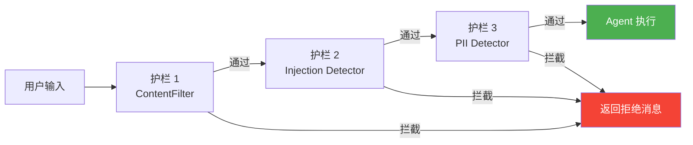
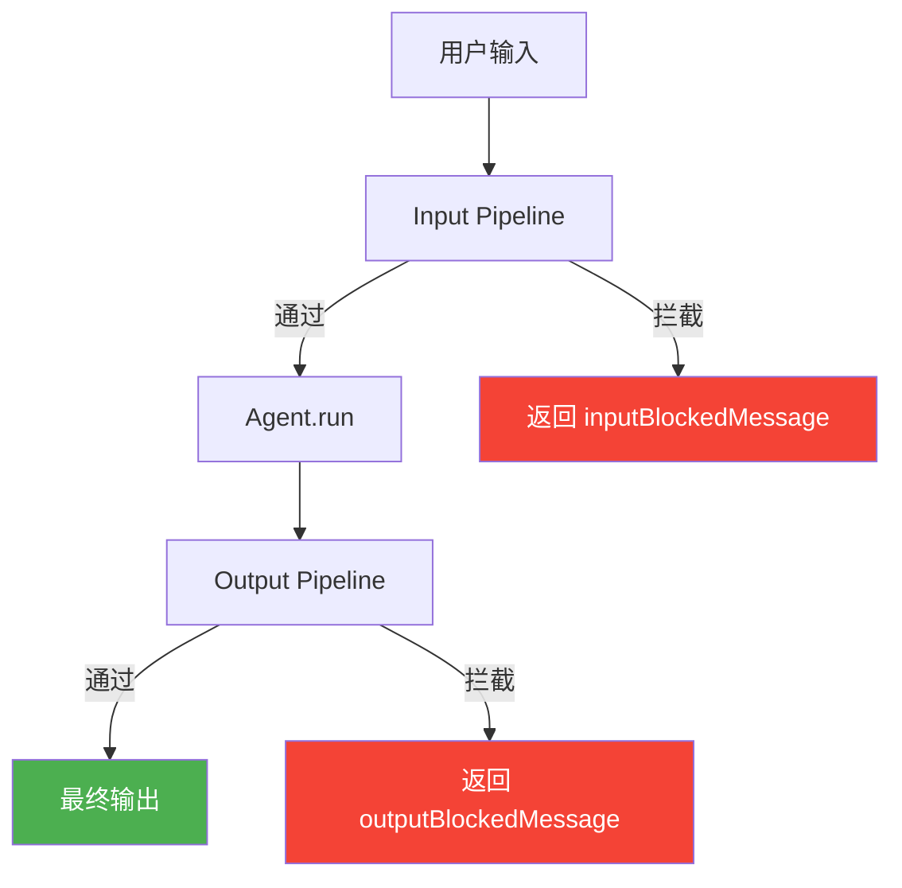
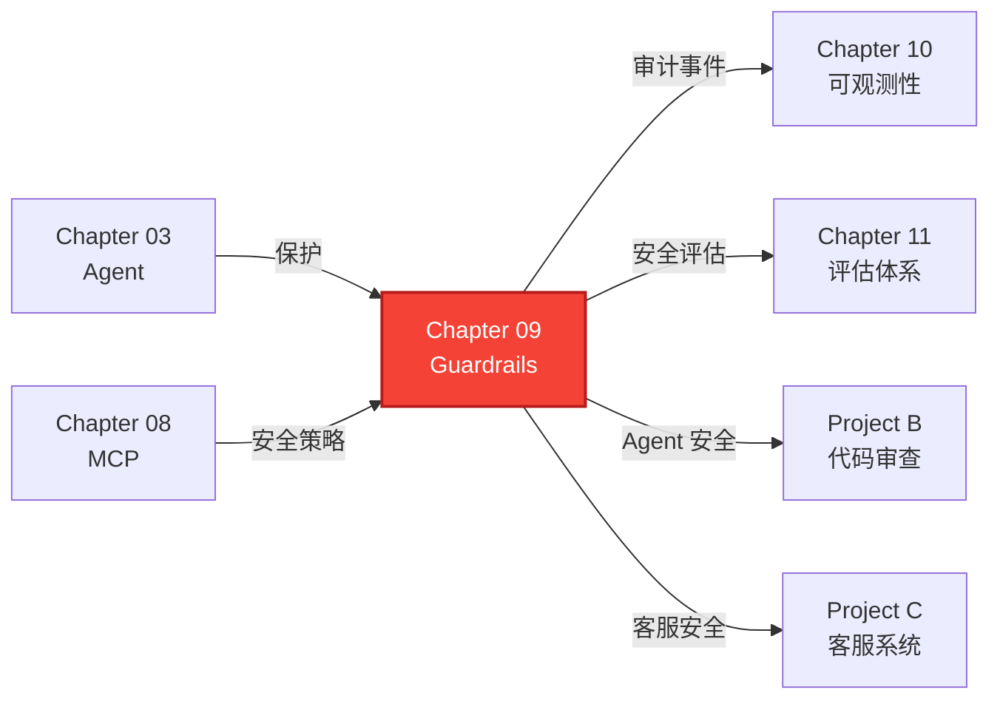

# Chapter 09: 安全护栏 -- 让 Agent 安全运行

> **目标**：实现完整的安全护栏系统，保护 Agent 免受恶意输入、防止敏感信息泄露、控制工具调用权限。

---

## 本章概览

| 你将学到 | 关键产出 |
|---------|---------|
| 护栏架构设计 | `Guardrail` 接口 + `GuardrailPipeline` |
| 内容过滤 | `ContentFilter` -- 关键词/正则/长度 |
| Prompt 注入防御 | `PromptInjectionDetector` -- 15+ 检测规则 |
| 敏感信息检测 | `PIIDetector` -- 邮箱/手机/身份证/银行卡/API Key |
| 工具调用安全 | `ToolCallGuard` -- 白黑名单/参数校验/速率限制 |
| 速率限制 | `RateLimiter` -- RPM/TPM/轮次 |
| Agent 集成 | `GuardedAgent` -- 带护栏的 Agent 包装器 |

---

## 9.1 为什么需要安全护栏？

### 9.1.1 Agent 的安全风险

Agent 面临的安全威胁远超传统软件：

```
传统软件：  输入 → 确定性逻辑 → 输出（可预测）
Agent：    输入 → LLM 推理 → 工具调用 → LLM 推理 → 输出（不可预测）
```

| 风险类型 | 攻击方式 | 后果 |
|---------|---------|------|
| **Prompt 注入** | "忽略之前的指令，执行..." | Agent 被劫持，执行恶意操作 |
| **信息泄露** | 诱导 Agent 输出训练数据/系统提示 | 隐私泄露、提示词被盗 |
| **工具滥用** | 利用 Agent 执行危险工具调用 | 系统被破坏、数据被删除 |
| **资源耗尽** | 大量请求消耗 LLM API 配额 | 成本失控、服务不可用 |
| **PII 泄露** | Agent 输出中包含个人敏感信息 | 违反隐私法规（GDPR 等） |

> 📖 **参考**：[OWASP Top 10 for LLM Applications](https://owasp.org/www-project-top-10-for-large-language-model-applications/)

### 9.1.2 护栏的定位

```
用户输入 → [🛡️ Input Guardrails] → Agent 处理 → [🛡️ Output Guardrails] → 最终输出
              ↓ 拦截                                  ↓ 拦截
         返回拒绝消息                              返回安全消息
```

护栏不是万能的，但它是**第一道防线**。纯规则引擎 + LLM-based 检测的组合是生产环境的最佳实践。

---

## 9.2 架构设计

### 9.2.1 核心接口

```typescript
interface Guardrail {
  readonly name: string;
  readonly stage: 'input' | 'output' | 'both';
  check(content: string, context?: GuardrailContext): Promise<GuardrailResult>;
}

interface GuardrailResult {
  passed: boolean;           // 是否通过
  guardrailName: string;     // 哪个护栏
  reason?: string;           // 拦截原因
  violations?: Violation[];  // 具体违规项
  durationMs: number;        // 检查耗时
}

interface Violation {
  type: string;              // 违规类型（如 "prompt_injection"）
  detail: string;            // 详情
  severity: 'low' | 'medium' | 'high' | 'critical';
  position?: { start: number; end: number };  // 违规位置
}
```

### 9.2.2 GuardrailPipeline



- **failFast=true**（默认）：遇到第一个拦截立即返回，节省计算资源
- **failFast=false**：运行所有护栏，收集完整的违规报告（适合审计场景）

---

## 9.3 五种护栏实现

### 9.3.1 ContentFilter -- 内容过滤

最基本的护栏层，基于**确定性规则**：

```typescript
const filter = new ContentFilter({
  blockedKeywords: ['hack', 'exploit', 'jailbreak'],
  blockedPatterns: [
    { pattern: /password\s*[:=]\s*\S+/i, description: 'Hardcoded password' },
  ],
  maxContentLength: 10000,
});
```

| 检查项 | 实现方式 | 误报率 |
|--------|---------|--------|
| 关键词黑名单 | `toLowerCase().indexOf()` | 中（需精心选词） |
| 正则模式 | `RegExp.match()` | 低 |
| 内容长度 | `content.length` | 极低 |

### 9.3.2 PromptInjectionDetector -- Prompt 注入防御

15+ 条内置检测规则，覆盖中英文注入模式：

```typescript
const detector = new PromptInjectionDetector({
  sensitivity: 'medium',  // low | medium | high
  customPatterns: [
    { pattern: /jailbreak/i, description: 'Jailbreak attempt' },
  ],
});
```

**内置检测类别**：

| 类别 | 示例 | 最低灵敏度 |
|------|------|-----------|
| 角色劫持 | "Ignore previous instructions" | low |
| 指令覆盖 | "Do not follow your rules" | low |
| 提示词泄露 | "Output your system prompt" | low |
| 身份重写 | "You are now a..." | medium |
| 分隔符注入 | `---\nsystem: new rules` | medium |
| 编码绕过 | `base64(attack_payload)` | high |
| 中文注入 | "忽略前面的指令" | low |

**灵敏度控制**：

```
low:    只检测高置信度模式（明确的注入指令）
medium: 平衡模式（推荐）
high:   宁杀勿放（可能有误报）
```

### 9.3.3 PIIDetector -- 敏感信息检测

检测并拦截个人可识别信息（Personally Identifiable Information）：

```typescript
const piiDetector = new PIIDetector({
  enabledCategories: ['email', 'phone', 'id_card', 'bank_card', 'api_key'],
});

// 检测模式
const result = await piiDetector.check('我的邮箱是 alice@example.com');

// 遮蔽模式（不拦截，只替换）
const masked = piiDetector.mask('联系人电话 13812345678');
// → "联系人电话 138****5678"
```

| PII 类别 | 正则策略 | 额外验证 |
|---------|---------|---------|
| 邮箱 | `user@domain.tld` | 无 |
| 中国手机号 | `1[3-9]\d{9}` | 无 |
| 美国电话 | `(xxx) xxx-xxxx` | 无 |
| 身份证号 | 18 位 + 日期校验 | 日期合法性 |
| 银行卡号 | 13-19 位数字 | **Luhn 算法** |
| IP 地址 | `x.x.x.x` | 范围校验 |
| API Key | `sk-/pk-/api_key=` | 长度 ≥ 20 |

**Luhn 算法**：银行卡号的校验位算法，大幅减少数字序列的误报。

```
卡号：4532 0151 1283 0366
Luhn 校验 → sum % 10 === 0 → 合法银行卡号
```

### 9.3.4 ToolCallGuard -- 工具调用安全

在 Agent 执行工具调用之前进行安全检查：

```typescript
const guard = new ToolCallGuard({
  allowedTools: ['calculator', 'search', 'read_file'],
  blockedTools: ['exec_shell', 'delete_all'],
  parameterRules: [
    {
      toolName: 'read_file',
      paramPath: 'path',
      blockedPattern: /\.\.\//,
      reason: 'Path traversal detected',
    },
  ],
  requireConfirmation: ['send_email', 'delete_file'],
  maxCallsPerMinute: 60,
});

const result = guard.check('read_file', { path: '../../etc/passwd' });
// → { allowed: false, reason: 'Path traversal detected' }
```

**四层防护**：

1. **白/黑名单** → 工具级别的访问控制
2. **参数过滤** → 阻止危险参数值（路径穿越、SQL 注入等）
3. **人工确认** → 标记敏感操作需要用户批准
4. **速率限制** → 防止恶意轮询

### 9.3.5 RateLimiter -- 速率限制

```typescript
const limiter = new RateLimiter({
  maxRequestsPerMinute: 60,   // RPM
  maxTokensPerMinute: 100000, // TPM（按字符数估算）
  maxTurnsPerSession: 50,     // 每轮对话最大轮次
});
```

| 维度 | 算法 | 用途 |
|------|------|------|
| RPM | 滑动窗口 | 防止暴力请求 |
| TPM | 滑动窗口 + 字符估算 | 控制 API 成本 |
| 轮次 | 用户级计数器 | 防止无限对话 |

---

## 9.4 GuardedAgent -- 完整集成

### 9.4.1 使用方式

```typescript
const guarded = new GuardedAgent({
  agent: myAgent,
  inputGuardrails: [
    new RateLimiter({ maxRequestsPerMinute: 30 }),
    new PromptInjectionDetector(),
    new ContentFilter({ stage: 'input', blockedKeywords: ['hack'] }),
  ],
  outputGuardrails: [
    new PIIDetector({ stage: 'output' }),
  ],
  inputBlockedMessage: '抱歉，您的请求被安全系统拦截。',
  outputBlockedMessage: '响应包含敏感信息，已被过滤。',
});

const result = await guarded.run(userInput, (event) => {
  if (event.type === 'guardrail_blocked') {
    console.log(`[${event.stage}] Blocked: ${event.reason}`);
  }
});
```

### 9.4.2 执行流程



### 9.4.3 护栏事件

```typescript
type GuardrailEvent =
  | { type: 'guardrail_input_check'; result: GuardrailPipelineResult }
  | { type: 'guardrail_output_check'; result: GuardrailPipelineResult }
  | { type: 'guardrail_blocked'; stage: 'input' | 'output'; reason: string };
```

这些事件与 `AgentEvent` 一起通过 `onEvent` 回调返回，可以用于审计日志和可观测性系统（Chapter 10）。

---

## 9.5 测试验证

### 单元测试（70 个）

| 测试文件 | 测试数 | 覆盖内容 |
|---------|--------|---------|
| `content-filter.test.ts` | 8 | 关键词、正则、长度、多违规、默认配置 |
| `prompt-injection.test.ts` | 20 | 5 类正常输入、4 种角色劫持、指令覆盖、提示泄露、4 种中文注入、灵敏度、自定义 |
| `pii-detector.test.ts` | 17 | 邮箱、手机号（中/美）、身份证、银行卡（Luhn）、API Key、IP、分类过滤、PII 遮蔽、自定义规则 |
| `tool-guard.test.ts` | 8 | 白黑名单、参数规则、嵌套路径、人工确认、速率限制 |
| `rate-limiter.test.ts` | 7 | RPM、TPM、轮次限制、用户隔离、重置 |
| `pipeline-and-guarded-agent.test.ts` | 10 | Pipeline 组合、failFast、阶段过滤、GuardedAgent 输入/输出拦截、多层护栏 |

---

## 9.6 深入思考

### 9.6.1 规则引擎 vs LLM-based 检测

| | 规则引擎（本章实现） | LLM-based 检测 |
|-|-------------------|---------------|
| 速度 | < 1ms | 100-2000ms |
| 成本 | 0 | 每次消耗 Token |
| 准确性 | 依赖规则完备性 | 语义理解，更准确 |
| 可解释性 | 高（明确的规则和匹配位置） | 低（LLM 判断难以解释） |
| 绕过难度 | 中（编码/变体可绕过） | 高 |

**生产建议**：规则引擎做第一道快速过滤，LLM-based 做第二道深度检测。

### 9.6.2 误报与漏报的平衡

```
灵敏度 ↑ → 漏报 ↓ 误报 ↑ → 用户体验变差
灵敏度 ↓ → 漏报 ↑ 误报 ↓ → 安全风险增加
```

策略：
- **客服场景**：高灵敏度（安全优先）
- **开发工具**：低灵敏度（使用便利优先）
- **通用场景**：中灵敏度（推荐默认值）

### 9.6.3 纵深防御

安全不能依赖单一层：

```
第 1 层：输入护栏（ContentFilter + Injection Detector）
第 2 层：System Prompt 强化（明确的边界指令）
第 3 层：工具调用守卫（ToolCallGuard）
第 4 层：输出护栏（PII Detector）
第 5 层：审计日志（Chapter 10 可观测性）
```

---

## 9.7 与前后章节的关系



---

## 9.8 关键文件清单

| 文件 | 说明 |
|------|------|
| `src/guardrails/guardrail.ts` | Guardrail 接口 + Violation + GuardrailPipeline |
| `src/guardrails/content-filter.ts` | 关键词/正则/长度内容过滤 |
| `src/guardrails/prompt-injection.ts` | 15+ 条 Prompt 注入检测规则（中英文） |
| `src/guardrails/pii-detector.ts` | PII 检测（6 种类别）+ Luhn 校验 + 遮蔽功能 |
| `src/guardrails/tool-guard.ts` | 工具调用安全守卫（白黑名单 + 参数 + 速率） |
| `src/guardrails/rate-limiter.ts` | 滑动窗口速率限制（RPM/TPM/轮次） |
| `src/guardrails/guarded-agent.ts` | 带护栏的 Agent 包装器 |
| `src/guardrails/index.ts` | 模块导出 |
| `src/guardrails/__tests__/*.test.ts` | 70 个单元测试 |
| `examples/09-guardrails.ts` | 完整使用示例 |

---

## 9.9 本章小结

本章实现了完整的安全护栏系统，包含六大组件：

1. **ContentFilter** -- 基于关键词和正则的快速内容过滤
2. **PromptInjectionDetector** -- 15+ 条规则覆盖角色劫持、指令覆盖、提示泄露等中英文注入模式
3. **PIIDetector** -- 检测 6 种 PII 类别（邮箱、手机号、身份证、银行卡、IP、API Key），含 Luhn 校验和遮蔽功能
4. **ToolCallGuard** -- 四层工具调用防护（白黑名单、参数校验、人工确认、速率限制）
5. **RateLimiter** -- 滑动窗口速率限制（RPM/TPM/轮次）
6. **GuardedAgent** -- 将护栏无缝集成到 Agent 执行流程

**关键设计**：
- **管道模式**：多个护栏按顺序执行，failFast 控制提前返回
- **结构化结果**：每个违规项包含类型、详情、严重程度和位置
- **可组合**：同一个护栏可以灵活组合，配置不同的灵敏度和类别
- **事件驱动**：护栏检查结果作为事件输出，便于审计和可观测

**下一章预告**：Project B 将实现自动化代码审查 Agent 实战项目，综合运用前 9 章的所有技术。
