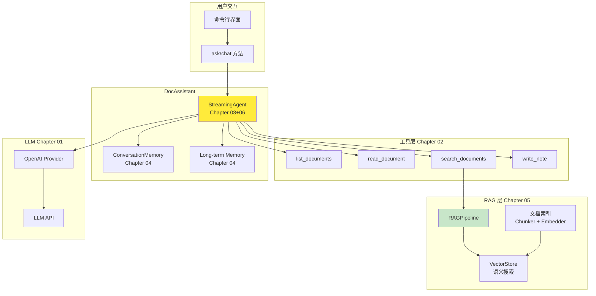
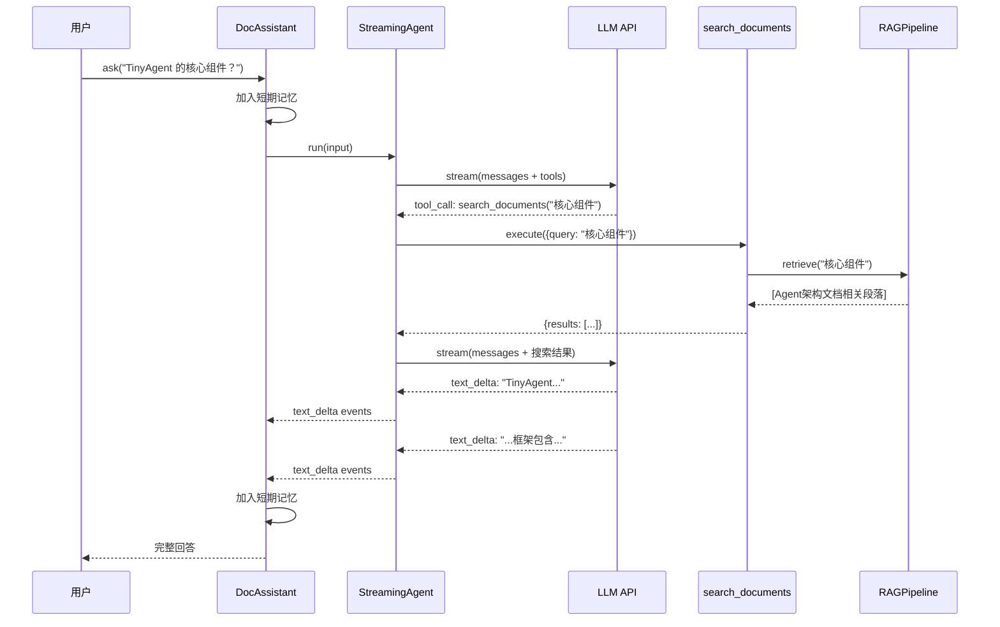

# Project A: 智能文档助手 -- 实战项目

> **目标**：将 Chapter 01-06 的全部能力整合为一个可运行的生产级应用，验证框架的实战能力。

---

## 项目概览

智能文档助手是一个基于 TinyAgent 框架的 RAG 应用，它能够：

1. **索引文档** -- 自动将 Markdown/文本文件分块并嵌入到向量数据库
2. **语义搜索** -- 通过自然语言查询找到最相关的文档段落
3. **智能问答** -- 基于检索到的文档上下文回答用户问题
4. **记忆对话** -- 支持多轮对话，记住上下文
5. **流式输出** -- 逐字显示回复，提升体验
6. **笔记功能** -- 让 Agent 自动生成并保存摘要

---

## 架构设计

### 技术栈映射

| 章节 | 能力 | 在本项目中的体现 |
|------|------|----------------|
| Ch01 LLM Provider | API 调用 | DocAssistant 的 LLM 后端 |
| Ch02 工具系统 | 工具定义与执行 | 4 个文档工具（list/read/search/write） |
| Ch03 ReAct 循环 | 推理与行动 | Agent 自动决定何时搜索、何时直答 |
| Ch04 记忆系统 | 对话上下文 | 多轮对话 + 长期偏好记忆 |
| Ch05 RAG | 知识检索 | 文档索引 + 语义搜索 |
| Ch06 流式输出 | 实时回复 | 逐字输出 + 工具调用提示 |

### 系统架构



### 数据流：一次完整的问答



---

## 核心实现

### 1. 工具设计 (tools.ts)

4 个工具覆盖了文档管理的 CRUD 操作：

```typescript
// 列出文档 -- 知识库概览
list_documents({ pattern?: string })

// 读取文档 -- 获取完整内容
read_document({ filename: string, maxLength?: number })

// 语义搜索 -- 基于 RAG 的智能检索
search_documents({ query: string, topK?: number })

// 写笔记 -- 生成并保存内容
write_note({ filename: string, content: string })
```

**安全设计**：
- `read_document` 包含路径穿越检测（`path.resolve` + 前缀检查）
- `write_note` 禁止包含路径分隔符的文件名

### 2. RAG 索引策略

根据文件类型选择不同的分块策略：

```typescript
const chunker = file.endsWith('.md')
  ? new MarkdownChunker({ maxChunkSize: 800 })
  : new FixedSizeChunker({ chunkSize: 600, overlap: 100 });
```

- **Markdown 文件**：按标题层级分块，保留语义完整性
- **其他文件**：固定大小分块 + 100 字符重叠，避免信息断裂

### 3. System Prompt 设计

```
You are an intelligent document assistant. You help users manage, 
search, and understand their document library.

## Behavior Guidelines
- Always use search_documents first when asked about content
- If search is insufficient, try read_document for full text
- Cite sources (mention filenames)
- Respond in the user's language
```

关键：指导 Agent **先搜索再回答**，确保回复基于文档事实而非幻觉。

### 4. 双接口设计

```typescript
// 流式 -- 逐字输出（适合交互式 UI）
async *chat(input: string): AsyncGenerator<AgentEvent>

// 非流式 -- 一次性返回（适合程序调用）
async ask(input: string): Promise<string>
```

---

## 测试覆盖

### 工具单元测试（11 个）

| 测试 | 验证内容 |
|------|---------|
| list_documents × 3 | 列出所有文件、pattern 过滤、空结果 |
| read_document × 3 | 读取内容、长度截断、路径穿越防护 |
| search_documents × 2 | 语义搜索结果、数量限制 |
| write_note × 3 | 文件写入、非法文件名、路径分隔符 |

### 集成测试（6 个）

| 测试 | 验证内容 |
|------|---------|
| 文档索引 | 文件索引 + 分块数量 |
| 列出文档 | Agent 使用 list_documents 工具 |
| RAG 搜索问答 | 完整 RAG 流程（索引→搜索→回答） |
| 会议纪要细节 | 从具体文档中提取信息 |
| 流式输出 | text_delta + answer 事件 |
| 写笔记 | Agent 调用 write_note 创建文件 |

---

## 文件清单

| 文件 | 说明 |
|------|------|
| `projects/doc-assistant/doc-assistant.ts` | 核心类，整合所有模块 |
| `projects/doc-assistant/tools.ts` | 4 个文档工具定义 |
| `projects/doc-assistant/main.ts` | 交互式命令行入口 |
| `projects/doc-assistant/sample-docs/` | 3 个示例文档 |
| `projects/doc-assistant/__tests__/tools.test.ts` | 工具单元测试 |
| `projects/doc-assistant/__tests__/doc-assistant.test.ts` | 集成测试 |

---

## 运行方式

```bash
# 确保 .env 中配置了 API Key
npx tsx projects/doc-assistant/main.ts
```

交互命令：
- 直接输入问题即可对话
- `/index` -- 重新索引文档
- `/reset` -- 重置对话
- `/quit` -- 退出

---

## 深入思考

### 1. 为什么用工具而非直接 RAG？

直接把 RAG 结果注入 system prompt 是一种方式（Chapter 05 的 `augment()` 方法），但本项目选择让 **Agent 自己决定何时搜索**。这带来了：

- **灵活性**：Agent 可以先搜索，发现信息不足时再读全文
- **可观测性**：每次搜索都是一个工具调用事件，可以追踪
- **组合能力**：Agent 可以组合多个工具（先列出文件，再读特定文件）

### 2. SimpleEmbedder 的局限

项目使用了 `SimpleEmbedder`（纯 TypeScript 的 TF + Feature Hashing），它的语义理解能力有限：
- 基于词频，不理解语义
- 同义词、上下文推理能力弱
- 适合演示和开发，生产环境建议用 OpenAI Embedding API

### 3. 记忆与 RAG 的协同

本项目同时使用了：
- **短期记忆**：记住本次对话的上下文
- **长期记忆**：存储用户偏好（如语言、关注领域）
- **RAG 知识库**：存储文档内容

三者各有分工，互不干扰。

---

## 本章小结

Project A 验证了 TinyAgent 框架的实战能力：

1. 6 个章节的能力被成功整合到一个真实应用中
2. 工具系统让 Agent 能够操作文件系统和知识库
3. RAG 让 Agent 基于文档事实回答问题
4. 流式输出提供了良好的用户体验
5. 安全设计（路径穿越防护、文件名校验）体现了生产级思维

**下一章预告**：Chapter 07 将实现 Multi-Agent 系统，让多个专业 Agent 协作完成复杂任务。
